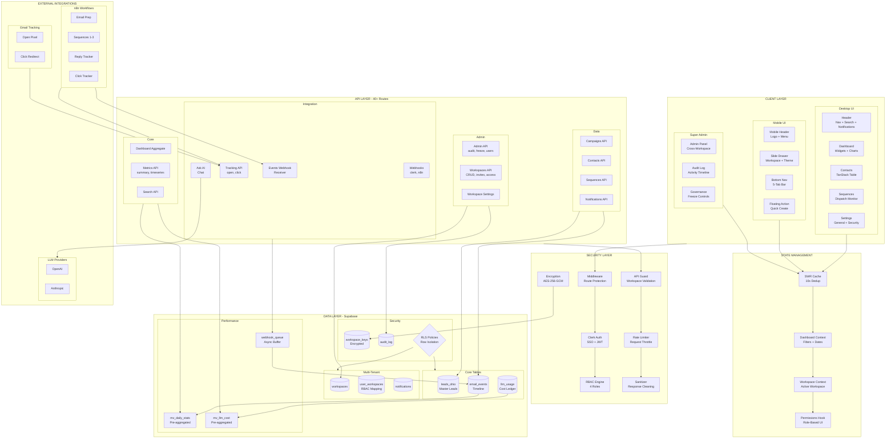

# ⚡ Cold Email Analytics Dashboard

A modern, high-performance analytics dashboard for tracking cold email campaigns powered by n8n workflows. Built with Next.js 14, featuring multi-tenant workspaces, real-time metrics, and AI-powered insights.

[](https://vercel.com/new/clone?repository-url=https://github.com/nishchith-m1015/cold-email-dashboard)

## 🌟 Features

### 📊 Real-Time Analytics

- **Live Metrics**: Track sends, opens, clicks, replies, and opt-outs in real-time
- **Cost Tracking**: Monitor LLM usage costs by provider and model
- **Time Series Charts**: Visualize trends with customizable date ranges
- **Sequence Analytics**: Break down performance by email sequence step

### 🏢 Multi-Tenant Architecture

- **Workspace Support**: Isolated data per organization
- **Role-Based Access**: Admin, Member, and Viewer roles
- **Team Collaboration**: Invite team members with granular permissions
- **Row Level Security**: Database-enforced data isolation

### 🚀 Performance Optimized

- **Materialized Views**: 10-30x faster queries with pre-aggregated data
- **SWR Caching**: 10-second deduplication prevents redundant requests
- **Lazy Loading**: 30% smaller bundle size with code splitting
- **Sub-100ms API**: Optimized database queries and caching

### 🎨 Modern UI/UX

- **Beautiful Dark Theme**: Eye-friendly design with smooth animations
- **Command Palette**: Quick navigation with ⌘K and fuzzy search
- **Interactive Onboarding**: Step-by-step guided tour for new users
- **Responsive Design**: Works perfectly on desktop, tablet, and mobile
- **Timezone Support**: Accurate time-based charts in any timezone
- **Error Boundaries**: Graceful failure handling with recovery

### ⚡ Client Self-Service

- **Global Search**: Fuzzy search across campaigns, contacts, and navigation (⌘K)
- **Inline Editing**: Edit campaign names directly in tables with real-time save
- **Quick Actions**: Right-click context menus with duplicate, archive, pause/resume
- **Notification Center**: Real-time alerts with unread badges and auto-polling
- **Bulk Operations**: Multi-select campaigns for batch pause/resume/delete
- **Customizable Dashboard**: Drag-and-drop widgets with visibility toggles
- **Settings Vault**: Unified settings management (workspace, timezone, security)

### 👑 Super Admin & Governance

- **Admin Dashboard**: Cross-workspace oversight at `/admin`
- **Audit Log Viewer**: Real-time activity timeline with filtering
- **Workspace Governance**: Freeze/unfreeze controls, compliance checks

### 📱 Mobile Sovereignty (Phase 38 ✅)

- **Bottom Navigation**: 5-tab nav for Home, Analytics, Contacts, Sequences, Settings
- **Mobile Drawer**: Slide-out menu with workspace switcher, theme toggle, sign-out
- **Responsive Pages**: Card-based views, bottom sheets, mobile-optimized layouts
- **Touch-Friendly**: FAB for quick actions, 44px tap targets, safe area handling
- **Polish**: Animated sign-out transition, centered branding on sign-in

### 🤖 AI-Powered Insights

- **Ask AI**: Natural language questions about your data
- **Smart Suggestions**: AI-generated optimization recommendations
- **Trend Detection**: Automatic identification of performance patterns

### 🧪 Production-Ready

- **83 Unit Tests**: 88-91% code coverage with Jest
- **9 E2E Tests**: Critical user paths verified with Playwright
- **Error Tracking**: Comprehensive error boundaries and logging
- **Type Safety**: Full TypeScript with strict mode

---

## 🏗️ Architecture



### Architecture Legend

| Layer        | Purpose                                               |
| ------------ | ----------------------------------------------------- |
| **CLIENT**   | Desktop UI, Mobile UI (Phase 38), Admin Panel         |
| **STATE**    | SWR caching, React contexts, permission hooks         |
| **SECURITY** | Clerk auth, RBAC (4 roles), rate limiting, encryption |
| **API**      | 40+ Next.js API routes across 27 domains              |
| **DATA**     | Supabase PostgreSQL with RLS, materialized views      |
| **EXTERNAL** | n8n workflows, LLM providers, email tracking          |

---

## 🚀 Quick Start (5 Minutes)

### Prerequisites

- Node.js 18+ and npm 9+
- Supabase account ([free tier available](https://supabase.com))
- Clerk account ([free tier available](https://clerk.com))

### 1. Clone & Install

```bash
git clone https://github.com/nishchith-m1015/cold-email-dashboard.git
cd cold-email-dashboard
npm install
```

### 2. Set up Supabase

1. Create a new project at [supabase.com](https://supabase.com/dashboard)
2. Go to **SQL Editor** and run `supabase/schema.sql`
3. Go to **Settings → API** and copy:
   - Project URL
   - `service_role` key (not anon key!)

### 3. Set up Clerk

1. Create an application at [clerk.com](https://dashboard.clerk.com)
2. Go to **API Keys** and copy:
   - Publishable Key
   - Secret Key

### 4. Configure Environment

```bash
cp .env.local.example .env.local
```

Edit `.env.local` with your keys:

```env
# Supabase
NEXT_PUBLIC_SUPABASE_URL=https://your-project.supabase.co
SUPABASE_SERVICE_ROLE_KEY=your-service-role-key

# Clerk
NEXT_PUBLIC_CLERK_PUBLISHABLE_KEY=pk_test_xxxxx
CLERK_SECRET_KEY=sk_test_xxxxx

# Webhook Security (generate with: openssl rand -hex 32)
DASH_WEBHOOK_TOKEN=your-random-token
```

### 5. Run Development Server

```bash
npm run dev
```

Open [http://localhost:3000](http://localhost:3000) 🎉

---

## 📖 Detailed Setup

See **[docs/ENVIRONMENT_VARIABLES.md](docs/ENVIRONMENT_VARIABLES.md)** for complete configuration guide.

---

## 🧪 Testing

### Unit Tests (Jest)

```bash
# Watch mode (development)
npm test

# CI mode (single run)
npm run test:ci

# With coverage report
npm run test:coverage
```

**Coverage**: 83 tests, 88-91% coverage across utilities, hooks, and components.

### E2E Tests (Playwright)

```bash
# Terminal 1: Start dev server with E2E mode
PLAYWRIGHT_TEST=true npm run dev

# Terminal 2: Run tests
npm run test:e2e              # Headless mode
npm run test:e2e:ui           # Interactive UI mode
```

**Coverage**: 9/12 tests passing (75%), covering critical user paths.

---

## 🚢 Deployment

### Deploy to Vercel (Recommended)

1. **Push to GitHub**:

   ```bash
   git push origin main
   ```

2. **Import in Vercel**:

   - Go to [vercel.com/new](https://vercel.com/new)
   - Import your repository
   - Framework: Next.js (auto-detected)

3. **Add Environment Variables**:
   Copy all variables from your `.env.local` (see [docs/ENVIRONMENT_VARIABLES.md](docs/ENVIRONMENT_VARIABLES.md))

4. **Deploy**: Click "Deploy" ✨

---

## 📚 Documentation

- **[Environment Variables](docs/ENVIRONMENT_VARIABLES.md)** - Complete environment setup guide
- **[Architecture](docs/ARCHITECTURE.md)** - System architecture deep dive
- **[Project Context](docs/PROJECT_CONTEXT.md)** - Project history and context

---

## 🛠️ Tech Stack

### Frontend

- **Framework**: Next.js 14 (App Router)
- **Language**: TypeScript (Strict Mode)
- **Styling**: Tailwind CSS
- **Components**: Radix UI
- **Charts**: Recharts
- **Icons**: Lucide React

### Backend

- **Runtime**: Vercel Edge Functions
- **Database**: Supabase (PostgreSQL)
- **Auth**: Clerk (Multi-tenant)
- **Caching**: SWR

### Testing

- **Unit Tests**: Jest + React Testing Library
- **E2E Tests**: Playwright
- **Coverage**: 85%+ target

---

## 📄 License

MIT License - see [LICENSE](LICENSE) for details.

---

**Questions?** Open an issue or contact [@nishchith-m1015](https://github.com/nishchith-m1015)
