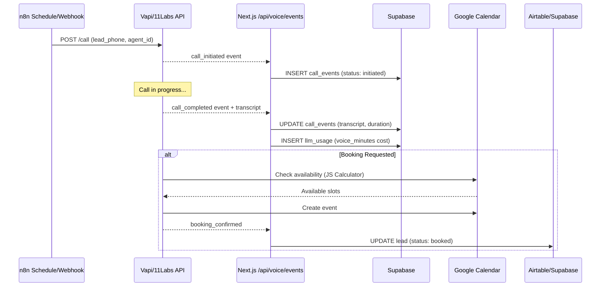
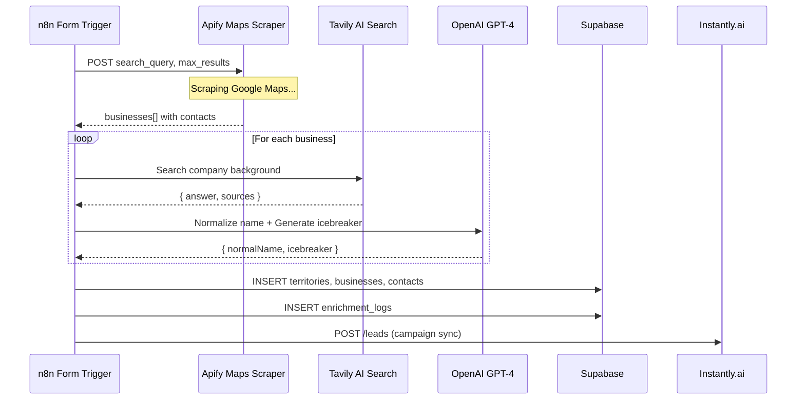
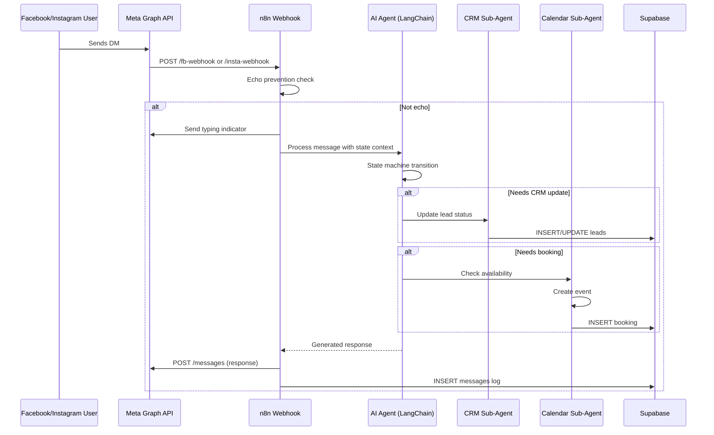
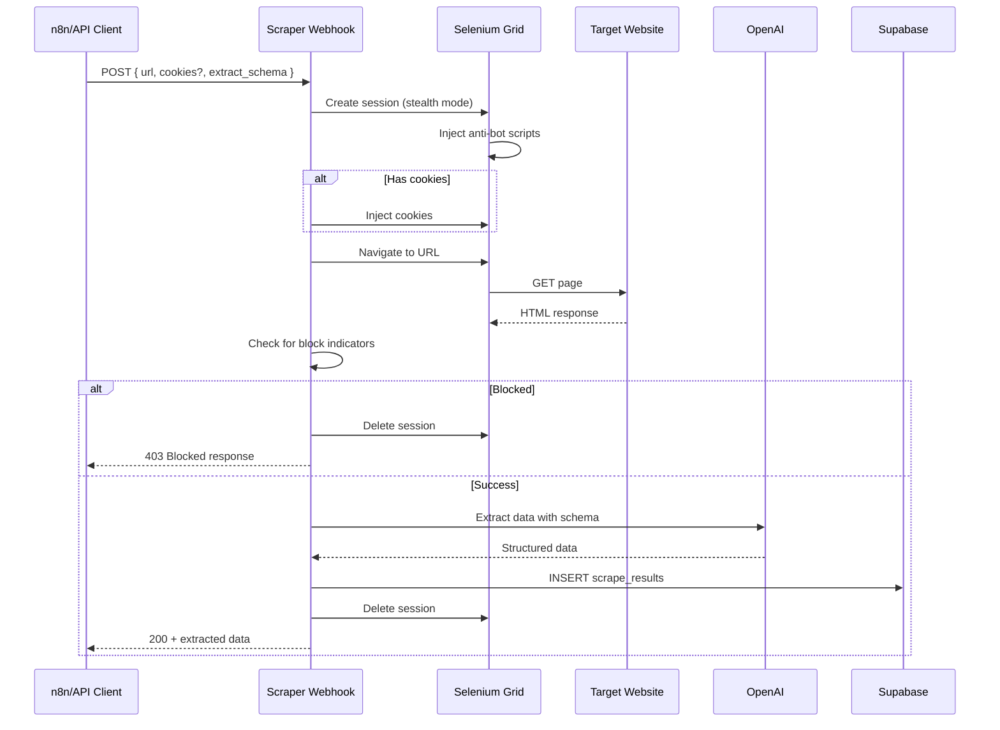
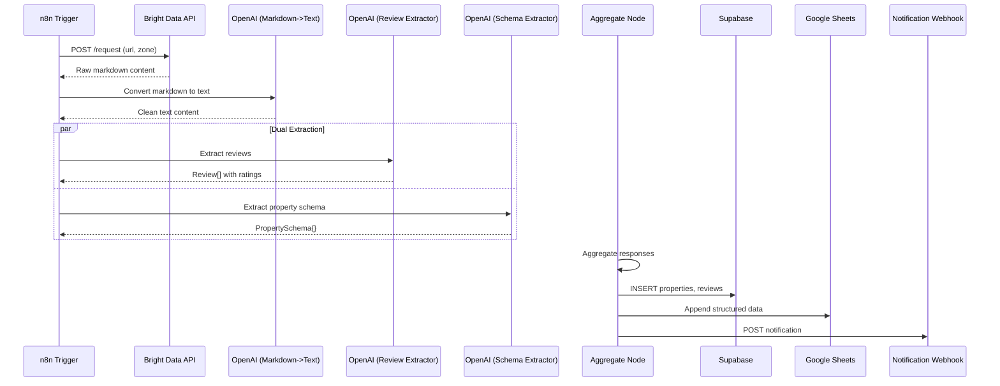

# The Magna Carta: 5 S-Tier Enterprise Infrastructures

> **Distinguished Technical Fellow (L10) Systems Architecture Document**
> 
> Multi-Vertical Automation Platform — Next.js + Supabase + n8n Hybrid Architecture

---

## Executive Summary

This document defines the architecture for **5 New S-Tier Systems** that will run on the existing `cold-email-dashboard` foundation. Each system is analyzed across **15 Technical Dimensions**, producing **75 deep-dive analysis points**.

**The Foundation:**
- **The Body:** Next.js 14 + Supabase (RLS, Triggers, Materialized Views)
- **The Brain:** n8n Workflows (Visual Logic, Webhooks, API Orchestration)
- **Inherited Patterns:** `idempotency_key`, `webhook_queue`, cost tracking, Zod validation

---

# RANK #1: AI VOICE AGENT INFRASTRUCTURE

> **Logic:** Outbound Vapi/11Labs orchestration with retry queues. Inbound JS availability calculator.
> 
> **Key Nodes:** 11Labs Outbound Call, Availability Calculator, AI Agent (Memory/Think/Airtable).

---

## Pillar 1: Architectural Data Flow



---

## Pillar 2: n8n Workflow Logic

**Source Files:** `Voice Agent Outbound Template.json`, `Inbound Voice Agent Template.json`

### Outbound Call Flow
1. **Trigger Node:** `Schedule Trigger` or `Webhook` (form submission)
2. **11Labs Outbound Call Node:** HTTP POST to `https://api.elevenlabs.io/v1/convai/twilio/outbound-call`
   - Payload: `{ agent_id, agent_phone_number_id, to_number: lead.phone }`
   - Auth: `httpHeaderAuth` with ElevenLabs API key
3. **Post-Call Webhook:** Receives transcript + call metadata
4. **Complete Transcript Node:** JavaScript code that formats transcript:
   ```javascript
   const transcript = webhookData.body.data.transcript;
   const formattedTranscript = transcript.map(entry => {
     const role = entry.role.charAt(0).toUpperCase() + entry.role.slice(1);
     return `${role}: ${entry.message}`;
   }).join('\n');
   ```

### Inbound Availability Calculator (Critical 80-line JS)
```javascript
// Core logic from Inbound Voice Agent Template
const workdayStartHour = 9;  // 9 AM
const workdayEndHour = 17;   // 5 PM
const minGapMinutes = 60;    // Minimum duration for a gap
const timeZone = 'America/Chicago';

// Finds gaps between calendar events for booking
function getMinutesDiff(endDate, startDate) {
  return Math.floor((endDate.getTime() - startDate.getTime()) / (1000 * 60));
}
// Returns availableSlots[] with { start, end, durationMinutes }
```

### AI Agent Sub-Workflow
- **AI Agent Node** with `Simple Memory` for conversation context
- **Think Tool** for reasoning steps
- **Airtable Tool** for mid-call CRM updates (status: in-Progress → called)

---

## Pillar 3: Concurrency Model

**Pattern:** Queue-based async processing (inherited from cold-email `webhook_queue` pattern)

```sql
-- New table for voice call queue
CREATE TABLE voice_call_queue (
  id UUID PRIMARY KEY DEFAULT uuid_generate_v4(),
  workspace_id TEXT NOT NULL DEFAULT 'default',
  lead_id UUID NOT NULL,
  phone_number TEXT NOT NULL,
  agent_id TEXT NOT NULL,
  attempt_number INTEGER DEFAULT 1,
  scheduled_at TIMESTAMP WITH TIME ZONE,
  status TEXT DEFAULT 'pending' CHECK (status IN ('pending', 'in_progress', 'completed', 'failed', 'voicemail')),
  locked_at TIMESTAMP WITH TIME ZONE,
  locked_by TEXT,
  created_at TIMESTAMP WITH TIME ZONE DEFAULT NOW()
);

-- Index for queue polling
CREATE INDEX idx_voice_queue_status_scheduled 
ON voice_call_queue(status, scheduled_at) 
WHERE status = 'pending';
```

**Concurrency Control:**
- n8n `splitInBatches` with batch size 1 for sequential calls
- Database-level pessimistic locking via `locked_at` column
- Max 10 concurrent calls per workspace (rate limit in API)

---

## Pillar 4: Idempotency Strategy

**Key Generation:** `hash(lead_id + attempt_number + date)`

```typescript
// In /api/voice/events/route.ts
const idempotencyKey = `voice:${call_id}:${event_type}:${Math.floor(Date.now() / 60000)}`;

// Check existing
const { data: existing } = await supabase
  .from('call_events')
  .select('id')
  .eq('workspace_id', workspaceId)
  .eq('metadata->>idempotency_key', idempotencyKey)
  .limit(1);

if (existing?.length > 0) {
  return NextResponse.json({ ok: true, deduped: true });
}
```

**Retry Deduplication:**
- Same lead + same day = increment attempt counter, don't create new call
- Webhook events deduplicated by `provider_message_id` (Vapi call ID)

---

## Pillar 5: Error Recovery

### n8n Level
- `onError: continueRegularOutput` on HTTP nodes
- Retry configuration: 3 retries with exponential backoff (10s, 30s, 90s)

### Database Level
```sql
-- Dead letter queue for failed calls
CREATE TABLE voice_call_dlq (
  id UUID PRIMARY KEY DEFAULT uuid_generate_v4(),
  original_call_id UUID REFERENCES voice_calls(id),
  error_code TEXT,
  error_message TEXT,
  retry_count INTEGER DEFAULT 0,
  max_retries INTEGER DEFAULT 3,
  next_retry_at TIMESTAMP WITH TIME ZONE,
  created_at TIMESTAMP WITH TIME ZONE DEFAULT NOW()
);

-- Trigger to move failed calls to DLQ
CREATE OR REPLACE FUNCTION handle_call_failure()
RETURNS TRIGGER AS $$
BEGIN
  IF NEW.status = 'failed' AND NEW.attempt_number < 3 THEN
    INSERT INTO voice_call_queue (lead_id, phone_number, agent_id, attempt_number, scheduled_at)
    VALUES (NEW.lead_id, NEW.phone_number, NEW.agent_id, NEW.attempt_number + 1, NOW() + INTERVAL '1 hour');
  ELSIF NEW.status = 'failed' THEN
    INSERT INTO voice_call_dlq (original_call_id, error_message, retry_count)
    VALUES (NEW.id, NEW.metadata->>'error', NEW.attempt_number);
  END IF;
  RETURN NEW;
END;
$$ LANGUAGE plpgsql;
```

---

## Pillar 6: Latency Budget

| Step | Expected Latency | Max Acceptable |
|------|------------------|----------------|
| Webhook receipt | 50ms | 200ms |
| DB idempotency check | 20ms | 100ms |
| Contact upsert | 30ms | 150ms |
| Call event insert | 25ms | 100ms |
| CRM update (async) | 500ms | 2000ms |
| **Total Webhook** | **125ms** | **500ms** |
| Voice call duration | 60-180s | 300s |
| Transcript processing | 2s | 10s |

---

## Pillar 7: Cost Optimization

### Voice Provider Costs
| Provider | Cost Model | Optimization |
|----------|------------|--------------|
| ElevenLabs | $0.30/min conversational | Limit calls to 3min max |
| Vapi | $0.05/min + LLM tokens | Use GPT-4o-mini for agent |
| Twilio | $0.0085/min inbound | Batch outbound in off-peak |

### Cost Tracking (inherited pattern)
```javascript
// In n8n workflow
costEvents.push({
  provider: 'elevenlabs',
  model: 'conversational_ai',
  tokens_in: 0,
  tokens_out: 0,
  cost_usd: call_duration_minutes * 0.30,
  campaign_name: campaignName,
  contact_email: leadEmail,
  purpose: 'voice_outbound_call',
  metadata: {
    call_duration_seconds: duration,
    outcome: call_outcome
  }
});
```

---

## Pillar 8: Security Boundaries

```
┌─────────────────────────────────────────────────────────────┐
│                    TRUST BOUNDARY                            │
├─────────────────────────────────────────────────────────────┤
│  n8n Cloud (Trusted)                                        │
│  ├─ Stores: API keys (encrypted)                            │
│  ├─ Executes: Workflow logic                                │
│  └─ Calls: External APIs                                    │
├─────────────────────────────────────────────────────────────┤
│  Next.js API (Validates)                                    │
│  ├─ x-webhook-token header (DASH_WEBHOOK_TOKEN)             │
│  ├─ Zod schema validation                                   │
│  ├─ Rate limiting (100 req/min per IP)                      │
│  └─ RLS via workspace_id                                    │
├─────────────────────────────────────────────────────────────┤
│  External APIs (Untrusted Input)                            │
│  ├─ Vapi webhooks: Verify signature                         │
│  ├─ ElevenLabs: Validate call_id format                     │
│  └─ Calendar: OAuth token refresh                           │
└─────────────────────────────────────────────────────────────┘
```

---

## Pillar 9: Database Schema Extension

```sql
-- ============================================
-- VOICE AGENT SCHEMA EXTENSION
-- ============================================

-- Voice agents configuration
CREATE TABLE voice_agents (
  id UUID PRIMARY KEY DEFAULT uuid_generate_v4(),
  workspace_id TEXT NOT NULL DEFAULT 'default',
  name TEXT NOT NULL,
  provider TEXT NOT NULL CHECK (provider IN ('elevenlabs', 'vapi', 'retell')),
  provider_agent_id TEXT NOT NULL,
  phone_number_id TEXT,
  voice_id TEXT,
  system_prompt TEXT,
  tools_config JSONB DEFAULT '[]',
  settings JSONB DEFAULT '{}',
  is_active BOOLEAN DEFAULT true,
  created_at TIMESTAMP WITH TIME ZONE DEFAULT NOW()
);

-- Voice calls log
CREATE TABLE voice_calls (
  id UUID PRIMARY KEY DEFAULT uuid_generate_v4(),
  workspace_id TEXT NOT NULL DEFAULT 'default',
  lead_id UUID REFERENCES contacts(id),
  agent_id UUID REFERENCES voice_agents(id),
  direction TEXT NOT NULL CHECK (direction IN ('inbound', 'outbound')),
  phone_number TEXT NOT NULL,
  provider_call_id TEXT UNIQUE,
  status TEXT DEFAULT 'initiated' CHECK (status IN ('initiated', 'ringing', 'in_progress', 'completed', 'failed', 'voicemail', 'no_answer')),
  duration_seconds INTEGER,
  transcript TEXT,
  summary TEXT,
  sentiment TEXT CHECK (sentiment IN ('positive', 'neutral', 'negative')),
  outcome TEXT CHECK (outcome IN ('booked', 'callback', 'not_interested', 'wrong_number', 'voicemail')),
  cost_cents INTEGER,
  attempt_number INTEGER DEFAULT 1,
  metadata JSONB DEFAULT '{}',
  started_at TIMESTAMP WITH TIME ZONE,
  ended_at TIMESTAMP WITH TIME ZONE,
  created_at TIMESTAMP WITH TIME ZONE DEFAULT NOW()
);

-- Call events (granular)
CREATE TABLE call_events (
  id UUID PRIMARY KEY DEFAULT uuid_generate_v4(),
  workspace_id TEXT NOT NULL DEFAULT 'default',
  call_id UUID REFERENCES voice_calls(id),
  event_type TEXT NOT NULL CHECK (event_type IN ('initiated', 'ringing', 'answered', 'transcript_update', 'tool_call', 'completed', 'failed')),
  event_data JSONB DEFAULT '{}',
  event_ts TIMESTAMP WITH TIME ZONE DEFAULT NOW(),
  created_at TIMESTAMP WITH TIME ZONE DEFAULT NOW()
);

-- Calendar availability slots
CREATE TABLE calendar_slots (
  id UUID PRIMARY KEY DEFAULT uuid_generate_v4(),
  workspace_id TEXT NOT NULL DEFAULT 'default',
  agent_id UUID REFERENCES voice_agents(id),
  calendar_id TEXT NOT NULL,
  start_time TIMESTAMP WITH TIME ZONE NOT NULL,
  end_time TIMESTAMP WITH TIME ZONE NOT NULL,
  is_booked BOOLEAN DEFAULT false,
  booking_id TEXT,
  created_at TIMESTAMP WITH TIME ZONE DEFAULT NOW()
);

-- Indexes
CREATE INDEX idx_voice_calls_workspace ON voice_calls(workspace_id);
CREATE INDEX idx_voice_calls_lead ON voice_calls(lead_id);
CREATE INDEX idx_voice_calls_status ON voice_calls(status);
CREATE INDEX idx_voice_calls_created ON voice_calls(created_at);
CREATE INDEX idx_call_events_call ON call_events(call_id);
```

---

## Pillar 10: Data Consistency Model

**Model:** Eventual Consistency with Conflict Resolution

| Data Type | Consistency | Rationale |
|-----------|-------------|-----------|
| Call initiation | Strong | Must prevent double-calling |
| Transcript updates | Eventual | Stream updates, final on completion |
| Calendar booking | Strong | Prevent double-booking |
| Cost tracking | Eventual | Aggregated nightly |
| Analytics | Eventual (5min) | Materialized view refresh |

```sql
-- Materialized view for voice analytics
CREATE MATERIALIZED VIEW voice_daily_stats AS
SELECT 
  workspace_id,
  DATE(created_at) as day,
  COUNT(*) as total_calls,
  COUNT(*) FILTER (WHERE status = 'completed') as completed_calls,
  COUNT(*) FILTER (WHERE outcome = 'booked') as bookings,
  AVG(duration_seconds) as avg_duration,
  SUM(cost_cents) as total_cost_cents
FROM voice_calls
GROUP BY workspace_id, DATE(created_at);

-- Refresh every 5 minutes
CREATE INDEX idx_voice_daily_stats_day ON voice_daily_stats(workspace_id, day);
```

---

## Pillar 11: Scalability Constraints

### Bottlenecks at 10k calls/day

| Component | Limit | Mitigation |
|-----------|-------|------------|
| ElevenLabs rate limit | 100 concurrent | Queue with backpressure |
| Supabase connections | 200 pooled | Connection pooling (PgBouncer) |
| n8n execution time | 5min default | Split long-running calls |
| Webhook processing | 500 req/s | Redis queue + workers |
| Calendar API | 100 req/min | Batch availability checks |

### Horizontal Scaling Strategy
```
Phase 1 (1-1k calls/day): Single n8n instance
Phase 2 (1k-10k): n8n Cloud with queue mode
Phase 3 (10k+): Dedicated voice microservice
```

---

## Pillar 12: Observability

### Required Logs
```typescript
// Structured logging format
const logEvent = {
  timestamp: new Date().toISOString(),
  service: 'voice-agent',
  level: 'info',
  event: 'call_completed',
  workspace_id: workspaceId,
  call_id: callId,
  lead_id: leadId,
  duration_ms: duration,
  outcome: outcome,
  cost_usd: cost,
  trace_id: req.headers.get('x-trace-id')
};
```

### Key Metrics
- `voice.calls.initiated` (counter)
- `voice.calls.completed` (counter)
- `voice.calls.duration_seconds` (histogram)
- `voice.bookings.created` (counter)
- `voice.cost.usd` (gauge)
- `voice.api.latency_ms` (histogram)

### Dashboard Queries
```sql
-- Real-time call status
SELECT status, COUNT(*) 
FROM voice_calls 
WHERE created_at > NOW() - INTERVAL '1 hour'
GROUP BY status;

-- Booking conversion rate
SELECT 
  DATE(created_at) as day,
  COUNT(*) FILTER (WHERE outcome = 'booked')::float / NULLIF(COUNT(*), 0) as booking_rate
FROM voice_calls
WHERE created_at > NOW() - INTERVAL '30 days'
GROUP BY DATE(created_at);
```

---

## Pillar 13: Type Safety

```typescript
// types/voice.ts
import { z } from 'zod';

export const VoiceCallEventSchema = z.object({
  call_id: z.string().uuid(),
  lead_id: z.string().uuid().optional(),
  phone_number: z.string().regex(/^\+[1-9]\d{1,14}$/),
  direction: z.enum(['inbound', 'outbound']),
  event_type: z.enum(['initiated', 'ringing', 'answered', 'completed', 'failed']),
  duration_seconds: z.number().int().min(0).optional(),
  transcript: z.string().max(100000).optional(),
  outcome: z.enum(['booked', 'callback', 'not_interested', 'wrong_number', 'voicemail']).optional(),
  cost_cents: z.number().int().min(0).optional(),
  workspace_id: z.string().max(100).optional(),
  idempotency_key: z.string().max(200),
  metadata: z.record(z.unknown()).optional(),
});

export type VoiceCallEvent = z.infer<typeof VoiceCallEventSchema>;

export interface VoiceAgentConfig {
  id: string;
  name: string;
  provider: 'elevenlabs' | 'vapi' | 'retell';
  providerAgentId: string;
  phoneNumberId: string;
  systemPrompt: string;
  tools: VoiceAgentTool[];
}

export interface VoiceAgentTool {
  name: string;
  type: 'calendar' | 'crm' | 'custom';
  config: Record<string, unknown>;
}
```

---

## Pillar 14: Maintenance Burden

### High Fragility Components
| Component | Fragility | Reason | Mitigation |
|-----------|-----------|--------|------------|
| ElevenLabs API | High | Frequent API changes | Version pinning, changelog monitoring |
| Vapi webhooks | Medium | Schema evolution | Zod validation with `.passthrough()` |
| Calendar OAuth | Medium | Token refresh failures | Proactive refresh, alerting |
| Transcript parsing | Low | Structured JSON | Schema validation |

### Version Pinning Strategy
```json
// n8n credentials version tracking
{
  "elevenlabs_api_version": "v1",
  "vapi_webhook_version": "2024-01",
  "google_calendar_api": "v3"
}
```

---

## Pillar 15: Future Optimization (L10 Recommendations)

### Phase 1: Foundation (Month 1-2)
- [ ] Implement voice call queue with PostgreSQL advisory locks
- [ ] Add transcript streaming via WebSocket
- [ ] Build availability caching layer (Redis)

### Phase 2: Intelligence (Month 3-4)
- [ ] Real-time sentiment analysis during calls
- [ ] Dynamic script adjustment based on lead profile
- [ ] A/B testing framework for voice prompts

### Phase 3: Scale (Month 5-6)
- [ ] Multi-tenant voice agent marketplace
- [ ] Custom voice cloning integration
- [ ] Predictive dialing with ML-based best-time-to-call

---

# RANK #2: GOOGLE MAPS LEAD FACTORY

> **Logic:** Apify Scraper -> Tavily Enrich -> OpenAI Name Norm -> JSON Schema Enforcement.
> 
> **Key Nodes:** Google Maps Scraper, Tavily Enrichment, Custom Messaging Chain.

---

## Pillar 1: Architectural Data Flow



---

## Pillar 2: n8n Workflow Logic

**Source File:** `Google Maps Skool Template (1).json`

### Key Nodes Analysis

1. **Form Trigger Node:**
   ```json
   {
     "formTitle": "Google Maps Scraper",
     "formFields": [
       { "fieldLabel": "Search query", "placeholder": "Coffee shops in Chicago" },
       { "fieldLabel": "Number of places to extract", "placeholder": "10" }
     ]
   }
   ```

2. **Google Maps Scraper (Apify):**
   ```javascript
   // HTTP POST to Apify run-sync endpoint
   {
     "url": "https://api.apify.com/v2/acts/compass~crawler-google-places/run-sync-get-dataset-items",
     "body": {
       "maxCrawledPlacesPerSearch": form['Number of places to extract'],
       "searchStringsArray": [form['Search query']],
       "leadsEnrichmentDepartments": ["c_suite", "sales", "operations", "marketing"],
       "maximumLeadsEnrichmentRecords": 1
     }
   }
   ```

3. **Tavily Enrichment Node:**
   ```javascript
   // Query construction
   `Find information about this company: ${companyName}
    Their website is: ${companyWebsite}
    Look for recent news, customer sentiment, and what sets them apart`
   ```

4. **Custom Messaging Chain (LLM):**
   - System prompt: 40+ lines defining icebreaker generation rules
   - Output parser: `{ normalName, icebreaker }` JSON schema
   - Bad example detection to avoid generic outputs

---

## Pillar 3: Concurrency Model

**Pattern:** Batch processing with rate limiting

```javascript
// n8n splitInBatches configuration
{
  "batchSize": 5,  // Process 5 businesses at a time
  "options": {
    "reset": false  // Continue from last batch on retry
  }
}

// Tavily rate limiting (10 req/min on free tier)
// Wait node between batches: 6 seconds
```

**Database Queue Pattern:**
```sql
CREATE TABLE territory_scrape_jobs (
  id UUID PRIMARY KEY DEFAULT uuid_generate_v4(),
  workspace_id TEXT NOT NULL,
  territory_id UUID REFERENCES territories(id),
  search_query TEXT NOT NULL,
  max_results INTEGER DEFAULT 100,
  status TEXT DEFAULT 'pending',
  progress_count INTEGER DEFAULT 0,
  error_message TEXT,
  started_at TIMESTAMP WITH TIME ZONE,
  completed_at TIMESTAMP WITH TIME ZONE,
  created_at TIMESTAMP WITH TIME ZONE DEFAULT NOW()
);
```

---

## Pillar 4: Idempotency Strategy

**Key Generation:** `hash(domain + territory_id)`

```javascript
// Deduplication in n8n Remove Duplicates node
{
  "mode": "removeItems",
  "compare": "selectedFields",
  "fieldsToCompare": {
    "fields": [
      { "fieldName": "website" },
      { "fieldName": "phone" }
    ]
  }
}

// Database constraint
ALTER TABLE businesses ADD CONSTRAINT unique_business_per_territory 
UNIQUE (workspace_id, territory_id, website_domain);
```

---

## Pillar 5: Error Recovery

### Apify Failures
```javascript
// n8n onError configuration
{
  "onError": "continueRegularOutput",
  "retryOnFail": true,
  "maxTries": 3,
  "waitBetweenTries": 10000
}
```

### Enrichment Failures
```sql
-- Partial success tracking
CREATE TABLE enrichment_logs (
  id UUID PRIMARY KEY DEFAULT uuid_generate_v4(),
  business_id UUID REFERENCES businesses(id),
  source TEXT NOT NULL, -- 'tavily', 'openai'
  status TEXT DEFAULT 'pending',
  input_data JSONB,
  output_data JSONB,
  error_message TEXT,
  retry_count INTEGER DEFAULT 0,
  cost_cents INTEGER,
  created_at TIMESTAMP WITH TIME ZONE DEFAULT NOW()
);

-- Retry incomplete enrichments
SELECT b.id, b.name 
FROM businesses b
LEFT JOIN enrichment_logs e ON e.business_id = b.id AND e.source = 'tavily'
WHERE e.id IS NULL OR e.status = 'failed';
```

---

## Pillar 6: Latency Budget

| Step | Expected | Max | Notes |
|------|----------|-----|-------|
| Form submission | 100ms | 500ms | Validation |
| Apify scrape (100 places) | 60s | 180s | Sync API |
| Tavily search (per business) | 2s | 5s | AI search |
| OpenAI icebreaker | 1s | 3s | GPT-4o-mini |
| DB insert batch | 50ms | 200ms | Bulk insert |
| Instantly sync | 500ms | 2s | Per lead |
| **Total (100 leads)** | **5-10min** | **30min** | Full pipeline |

---

## Pillar 7: Cost Optimization

### Per-Lead Cost Breakdown
| Service | Cost | Optimization |
|---------|------|--------------|
| Apify Maps | $0.02/place | Use `maximumLeadsEnrichmentRecords: 1` |
| Tavily | $0.01/search | Cache company profiles |
| OpenAI | $0.002/icebreaker | Use GPT-4o-mini |
| **Total** | **$0.032/lead** | Sell at $0.50 = 15.6x margin |

### Caching Strategy
```sql
-- Company profile cache (30-day TTL)
CREATE TABLE company_cache (
  id UUID PRIMARY KEY DEFAULT uuid_generate_v4(),
  domain TEXT UNIQUE NOT NULL,
  company_data JSONB NOT NULL,
  tavily_response JSONB,
  expires_at TIMESTAMP WITH TIME ZONE DEFAULT NOW() + INTERVAL '30 days',
  created_at TIMESTAMP WITH TIME ZONE DEFAULT NOW()
);

-- Check cache before Tavily call
SELECT company_data FROM company_cache 
WHERE domain = $1 AND expires_at > NOW();
```

---

## Pillar 8: Security Boundaries

```
┌─────────────────────────────────────────────────────────────┐
│  User Input (Untrusted)                                     │
│  └─ Search query: Sanitize for injection                    │
├─────────────────────────────────────────────────────────────┤
│  n8n Workflow (Trusted)                                     │
│  ├─ Apify API key: Encrypted in credentials                 │
│  ├─ Tavily API key: Environment variable                    │
│  └─ OpenAI key: Credential rotation enabled                 │
├─────────────────────────────────────────────────────────────┤
│  Database (Validated)                                       │
│  ├─ RLS by workspace_id                                     │
│  └─ Input sanitization on all text fields                   │
├─────────────────────────────────────────────────────────────┤
│  External Sync (Authenticated)                              │
│  └─ Instantly API: Bearer token, per-campaign isolation     │
└─────────────────────────────────────────────────────────────┘
```

---

## Pillar 9: Database Schema Extension

```sql
-- ============================================
-- GOOGLE MAPS LEAD FACTORY SCHEMA
-- ============================================

-- Territories (geographic search areas)
CREATE TABLE territories (
  id UUID PRIMARY KEY DEFAULT uuid_generate_v4(),
  workspace_id TEXT NOT NULL DEFAULT 'default',
  name TEXT NOT NULL,
  search_query TEXT NOT NULL,
  location_lat DECIMAL(10, 8),
  location_lng DECIMAL(11, 8),
  radius_km INTEGER DEFAULT 50,
  business_count INTEGER DEFAULT 0,
  last_scraped_at TIMESTAMP WITH TIME ZONE,
  scrape_frequency_days INTEGER DEFAULT 30,
  is_active BOOLEAN DEFAULT true,
  created_at TIMESTAMP WITH TIME ZONE DEFAULT NOW()
);

-- Businesses scraped from Google Maps
CREATE TABLE businesses (
  id UUID PRIMARY KEY DEFAULT uuid_generate_v4(),
  workspace_id TEXT NOT NULL DEFAULT 'default',
  territory_id UUID REFERENCES territories(id),
  google_place_id TEXT,
  name TEXT NOT NULL,
  normalized_name TEXT,
  website TEXT,
  website_domain TEXT,
  phone TEXT,
  address TEXT,
  city TEXT,
  state TEXT,
  postal_code TEXT,
  country TEXT DEFAULT 'US',
  category TEXT,
  rating DECIMAL(2, 1),
  review_count INTEGER,
  google_maps_url TEXT,
  enrichment_status TEXT DEFAULT 'pending',
  icebreaker TEXT,
  custom_fields JSONB DEFAULT '{}',
  created_at TIMESTAMP WITH TIME ZONE DEFAULT NOW()
);

-- Business contacts (decision makers)
CREATE TABLE business_contacts (
  id UUID PRIMARY KEY DEFAULT uuid_generate_v4(),
  workspace_id TEXT NOT NULL DEFAULT 'default',
  business_id UUID REFERENCES businesses(id),
  first_name TEXT,
  last_name TEXT,
  email TEXT,
  linkedin_url TEXT,
  job_title TEXT,
  department TEXT,
  is_primary BOOLEAN DEFAULT false,
  source TEXT DEFAULT 'apify',
  created_at TIMESTAMP WITH TIME ZONE DEFAULT NOW()
);

-- Indexes
CREATE INDEX idx_territories_workspace ON territories(workspace_id);
CREATE INDEX idx_businesses_territory ON businesses(territory_id);
CREATE INDEX idx_businesses_domain ON businesses(website_domain);
CREATE INDEX idx_business_contacts_email ON business_contacts(email);
```

---

## Pillar 10: Data Consistency Model

| Data | Model | Rationale |
|------|-------|-----------|
| Territory config | Strong | User-facing settings |
| Business data | Eventual | Batch updates OK |
| Enrichment status | Strong | Prevents duplicate enrichment |
| Icebreakers | Eventual | Can regenerate |
| Instantly sync | Eventual | External system |

---

## Pillar 11: Scalability Constraints

| Component | Limit | Bottleneck | Mitigation |
|-----------|-------|------------|------------|
| Apify concurrent | 10 actors | Memory per actor | Queue with priorities |
| Tavily free tier | 1000 req/mo | Hard limit | Upgrade to $20/mo plan |
| OpenAI rate | 10K TPM | Throughput | Batch requests |
| Supabase rows | 500K free | Storage | Archive old territories |
| Instantly campaigns | 100 active | Platform limit | Multiple workspaces |

---

## Pillar 12: Observability

### Key Metrics
```sql
-- Territory health dashboard
SELECT 
  t.name,
  t.business_count,
  COUNT(b.id) FILTER (WHERE b.enrichment_status = 'completed') as enriched,
  COUNT(b.id) FILTER (WHERE b.enrichment_status = 'failed') as failed,
  t.last_scraped_at,
  CASE WHEN t.last_scraped_at < NOW() - INTERVAL '30 days' THEN 'stale' ELSE 'fresh' END as freshness
FROM territories t
LEFT JOIN businesses b ON b.territory_id = t.id
GROUP BY t.id;
```

---

## Pillar 13: Type Safety

```typescript
// types/maps.ts
import { z } from 'zod';

export const TerritorySchema = z.object({
  name: z.string().min(1).max(200),
  search_query: z.string().min(3).max(500),
  location_lat: z.number().min(-90).max(90).optional(),
  location_lng: z.number().min(-180).max(180).optional(),
  radius_km: z.number().int().min(1).max(500).default(50),
});

export const BusinessSchema = z.object({
  google_place_id: z.string().optional(),
  name: z.string().min(1),
  website: z.string().url().optional(),
  phone: z.string().optional(),
  address: z.string().optional(),
  rating: z.number().min(0).max(5).optional(),
  review_count: z.number().int().min(0).optional(),
});

export const IcebreakerOutputSchema = z.object({
  normalName: z.string(),
  icebreaker: z.string().max(500),
});
```

---

## Pillar 14: Maintenance Burden

| Component | Fragility | Issue | Mitigation |
|-----------|-----------|-------|------------|
| Apify actor | Medium | Actor updates | Pin to specific version |
| Google Maps HTML | High | Structure changes | Apify handles this |
| Tavily API | Low | Stable | Monitor changelog |
| Instantly API | Medium | v2 migration | Abstract behind service |

---

## Pillar 15: Future Optimization (L10 Recommendations)

### Phase 1: Quality
- [ ] Review sentiment analysis before enrichment
- [ ] Competitor detection (skip if competitor)
- [ ] Business hours filtering (only open businesses)

### Phase 2: Scale
- [ ] Multi-territory parallel scraping
- [ ] Incremental updates (only new businesses)
- [ ] Distributed enrichment workers

### Phase 3: Intelligence
- [ ] Industry classification model
- [ ] Revenue estimation from signals
- [ ] Best-time-to-contact prediction

---

# RANK #3: SOCIAL DM AI AGENT

> **Logic:** State Machine (Qualifying -> Scheduling) via System Prompt. Multi-channel (FB/Insta) routing.
> 
> **Key Nodes:** Switch (Graph API), Echo Prevention, Typing Indicators.

---

## Pillar 1: Architectural Data Flow



---

## Pillar 2: n8n Workflow Logic

**Source Files:** `DM AGENT - INSTA , FB/Main_workflow.json`, `Calendar_workflow.json`, `CRM_workflow.json`

### State Machine System Prompt (100+ lines)
```javascript
// Core states
const STATES = {
  INITIAL: 'greeting',
  QUALIFYING: 'understanding needs',
  CONTACT_COLLECTION: 'gathering info',
  SCHEDULING: 'booking appointment',
  FOLLOW_UP: 'confirmation'
};

// System prompt excerpt
`## 4. Conversation Flow & Actions

### State: INITIAL
* **Goal:** Greet the user.
* **Action:** Start with a simple hello like: "Hi! How can we help you?"

### State: QUALIFYING
* **Goal:** Understand the user's solar needs.
* **Action:** Use technical_and_sales_knowledge to answer questions.
* **Move to CONTACT_COLLECTION only after clear interest.**

### State: CONTACT_COLLECTION
* **WhatsApp Trigger:** Skip this step — you already have contact info.
* **Other Triggers:** Ask for First Name, then Email Address.
* **Use crmAgent right after collecting info.**

### State: SCHEDULING
* **Goal:** Book a consultation using calendarAgent.
* **Requirements:** Name + Email must be saved and logged.`
```

### Echo Prevention (Critical)
```javascript
// If node checking for echo
{
  "conditions": [{
    "leftValue": "={{ $json.body.entry[0].messaging[0].message?.is_echo }}",
    "operator": { "operation": "false" }
  }]
}
```

### Typing Indicator
```javascript
// Facebook Graph API call
{
  "node": "me",
  "edge": "messages",
  "queryParametersJson": {
    "recipient": { "id": "{{ sender_id }}" },
    "sender_action": "typing_on"
  }
}
```

---

## Pillar 3: Concurrency Model

**Pattern:** Session-based locking with Redis

```typescript
// Conversation lock to prevent race conditions
const lockKey = `dm:lock:${platform}:${senderId}`;
const lock = await redis.set(lockKey, executionId, 'NX', 'EX', 30);

if (!lock) {
  // Another execution is handling this conversation
  return { status: 'skipped', reason: 'locked' };
}

try {
  // Process message
} finally {
  await redis.del(lockKey);
}
```

---

## Pillar 4: Idempotency Strategy

**Key:** `platform:sender_id:message_id`

```sql
-- Message deduplication
CREATE TABLE dm_messages (
  id UUID PRIMARY KEY DEFAULT uuid_generate_v4(),
  workspace_id TEXT NOT NULL,
  platform TEXT NOT NULL CHECK (platform IN ('facebook', 'instagram', 'whatsapp')),
  platform_message_id TEXT NOT NULL,
  conversation_id UUID REFERENCES dm_conversations(id),
  direction TEXT NOT NULL CHECK (direction IN ('inbound', 'outbound')),
  content TEXT,
  created_at TIMESTAMP WITH TIME ZONE DEFAULT NOW(),
  UNIQUE(workspace_id, platform, platform_message_id)
);
```

---

## Pillar 5: Error Recovery

### Platform API Failures
```javascript
// Retry with exponential backoff
const retryConfig = {
  maxRetries: 3,
  baseDelay: 1000,
  maxDelay: 10000,
  shouldRetry: (error) => {
    // Retry on rate limits and transient errors
    return error.code === 'RATE_LIMITED' || 
           error.code === 'SERVICE_UNAVAILABLE';
  }
};
```

### State Recovery
```sql
-- Conversation state persistence
CREATE TABLE dm_conversations (
  id UUID PRIMARY KEY DEFAULT uuid_generate_v4(),
  workspace_id TEXT NOT NULL,
  platform TEXT NOT NULL,
  platform_user_id TEXT NOT NULL,
  current_state TEXT DEFAULT 'INITIAL',
  context_json JSONB DEFAULT '{}',
  collected_info JSONB DEFAULT '{}',
  last_message_at TIMESTAMP WITH TIME ZONE,
  created_at TIMESTAMP WITH TIME ZONE DEFAULT NOW(),
  UNIQUE(workspace_id, platform, platform_user_id)
);
```

---

## Pillar 6: Latency Budget

| Step | Target | Max | Notes |
|------|--------|-----|-------|
| Webhook receipt | 50ms | 200ms | Must respond quickly |
| Echo check | 5ms | 20ms | In-memory |
| Typing indicator | 100ms | 500ms | Fire-and-forget |
| AI Agent response | 2s | 5s | GPT-4o-mini |
| Tool calls (CRM/Calendar) | 500ms | 2s | Each |
| Send response | 200ms | 1s | Meta API |
| **Total perceived** | **<3s** | **<8s** | User experience |

---

## Pillar 7: Cost Optimization

### Per-Conversation Costs
| Component | Cost | Optimization |
|-----------|------|--------------|
| OpenAI (avg 5 turns) | $0.01 | Use GPT-4o-mini |
| Meta API | Free | No cost |
| Calendar API | Free | Google Workspace |
| **Total** | **$0.01/conv** | High margin |

---

## Pillar 8: Security Boundaries

```
┌─────────────────────────────────────────────────────────────┐
│  Meta Platform (External Trust)                             │
│  ├─ Webhook verification: hub.challenge                     │
│  ├─ Signature validation: X-Hub-Signature-256               │
│  └─ App secret verification                                 │
├─────────────────────────────────────────────────────────────┤
│  n8n Workflow (Internal Trust)                              │
│  ├─ Platform tokens: Encrypted credentials                  │
│  ├─ AI Agent: Sandboxed tool access                         │
│  └─ Rate limiting: Per-page limits                          │
├─────────────────────────────────────────────────────────────┤
│  Data Handling                                              │
│  ├─ PII: Name, email stored encrypted                       │
│  ├─ Messages: 30-day retention, then anonymized             │
│  └─ GDPR: Deletion endpoint implemented                     │
└─────────────────────────────────────────────────────────────┘
```

---

## Pillar 9: Database Schema Extension

```sql
-- ============================================
-- SOCIAL DM AGENT SCHEMA
-- ============================================

-- Connected social channels
CREATE TABLE social_channels (
  id UUID PRIMARY KEY DEFAULT uuid_generate_v4(),
  workspace_id TEXT NOT NULL DEFAULT 'default',
  platform TEXT NOT NULL CHECK (platform IN ('facebook', 'instagram', 'whatsapp')),
  page_id TEXT NOT NULL,
  page_name TEXT,
  access_token TEXT NOT NULL, -- Encrypted
  token_expires_at TIMESTAMP WITH TIME ZONE,
  webhook_verified BOOLEAN DEFAULT false,
  is_active BOOLEAN DEFAULT true,
  created_at TIMESTAMP WITH TIME ZONE DEFAULT NOW(),
  UNIQUE(workspace_id, platform, page_id)
);

-- DM Conversations
CREATE TABLE dm_conversations (
  id UUID PRIMARY KEY DEFAULT uuid_generate_v4(),
  workspace_id TEXT NOT NULL DEFAULT 'default',
  channel_id UUID REFERENCES social_channels(id),
  platform_user_id TEXT NOT NULL,
  platform_user_name TEXT,
  current_state TEXT DEFAULT 'INITIAL',
  context_json JSONB DEFAULT '{}',
  collected_info JSONB DEFAULT '{}',
  lead_id UUID REFERENCES contacts(id),
  booking_id UUID,
  message_count INTEGER DEFAULT 0,
  last_message_at TIMESTAMP WITH TIME ZONE,
  created_at TIMESTAMP WITH TIME ZONE DEFAULT NOW()
);

-- DM Messages
CREATE TABLE dm_messages (
  id UUID PRIMARY KEY DEFAULT uuid_generate_v4(),
  workspace_id TEXT NOT NULL DEFAULT 'default',
  conversation_id UUID REFERENCES dm_conversations(id),
  platform_message_id TEXT,
  direction TEXT NOT NULL CHECK (direction IN ('inbound', 'outbound')),
  content TEXT,
  message_type TEXT DEFAULT 'text',
  tool_calls JSONB,
  tokens_used INTEGER,
  cost_usd DECIMAL(10, 6),
  created_at TIMESTAMP WITH TIME ZONE DEFAULT NOW()
);

-- Agent configurations
CREATE TABLE dm_agent_configs (
  id UUID PRIMARY KEY DEFAULT uuid_generate_v4(),
  workspace_id TEXT NOT NULL DEFAULT 'default',
  name TEXT NOT NULL,
  system_prompt TEXT NOT NULL,
  model TEXT DEFAULT 'gpt-4o-mini',
  temperature DECIMAL(2, 1) DEFAULT 0.7,
  tools_enabled JSONB DEFAULT '["crm", "calendar"]',
  business_hours JSONB,
  auto_reply_enabled BOOLEAN DEFAULT true,
  created_at TIMESTAMP WITH TIME ZONE DEFAULT NOW()
);

-- Indexes
CREATE INDEX idx_dm_conversations_channel ON dm_conversations(channel_id);
CREATE INDEX idx_dm_conversations_state ON dm_conversations(current_state);
CREATE INDEX idx_dm_messages_conversation ON dm_messages(conversation_id);
```

---

## Pillar 10: Data Consistency Model

| Data | Model | Rationale |
|------|-------|-----------|
| Conversation state | Strong | Prevents duplicate state transitions |
| Message log | Eventual | Audit trail, not critical path |
| Lead creation | Strong | Must not duplicate |
| Booking | Strong | Calendar integrity |

---

## Pillar 11: Scalability Constraints

| Component | Limit | Impact | Mitigation |
|-----------|-------|--------|------------|
| Meta rate limit | 200 calls/hour/page | Response delays | Message queuing |
| n8n execution | 5min timeout | Long conversations | Split into sub-workflows |
| OpenAI context | 128K tokens | Memory limits | Sliding window |
| Supabase connections | 200 | Concurrent conversations | Connection pooling |

---

## Pillar 12: Observability

### Key Metrics
- `dm.conversations.started` (counter, by platform)
- `dm.conversations.converted` (counter, to booking)
- `dm.response.latency_ms` (histogram)
- `dm.agent.tokens_used` (counter)
- `dm.state.transitions` (counter, by from_state, to_state)

---

## Pillar 13: Type Safety

```typescript
// types/dm.ts
import { z } from 'zod';

export const ConversationStateSchema = z.enum([
  'INITIAL',
  'QUALIFYING', 
  'CONTACT_COLLECTION',
  'SCHEDULING',
  'FOLLOW_UP',
  'COMPLETED'
]);

export const DMMessageSchema = z.object({
  platform: z.enum(['facebook', 'instagram', 'whatsapp']),
  platform_message_id: z.string(),
  sender_id: z.string(),
  content: z.string().max(2000),
  timestamp: z.string().datetime(),
});

export const CollectedInfoSchema = z.object({
  name: z.string().optional(),
  email: z.string().email().optional(),
  phone: z.string().optional(),
  service_interest: z.string().optional(),
  preferred_time: z.string().optional(),
});
```

---

## Pillar 14: Maintenance Burden

| Component | Fragility | Issue | Mitigation |
|-----------|-----------|-------|------------|
| Meta Graph API | High | Frequent deprecations | Version pinning (v21.0) |
| Token refresh | Medium | 60-day expiry | Proactive refresh job |
| Webhook URL | Low | Stable | Use permanent URL |
| AI prompts | Medium | Behavior drift | Prompt versioning |

---

## Pillar 15: Future Optimization (L10 Recommendations)

### Phase 1: Multi-Channel
- [ ] WhatsApp Business API integration
- [ ] LinkedIn messaging (unofficial)
- [ ] SMS fallback for no-response

### Phase 2: Intelligence
- [ ] Sentiment-based routing to human
- [ ] Multi-language support with auto-detection
- [ ] Image/media handling in conversations

### Phase 3: Enterprise
- [ ] Multi-agent routing (sales, support, billing)
- [ ] SLA tracking and escalation
- [ ] Conversation analytics dashboard

---

# RANK #4: ULTIMATE BROWSER SCRAPER

> **Logic:** Selenium Orchestration with anti-bot hardening (Cookie Injection, Stealth Scripts).
> 
> **Key Nodes:** Create/Delete Session, Check Block, OpenAI Reasoning.

---

## Pillar 1: Architectural Data Flow



---

## Pillar 2: n8n Workflow Logic

**Source File:** `Ultimate Scraper Workflow for n8n.json`

### Key Nodes Analysis

1. **Create Selenium Session:**
   ```javascript
   {
     "url": "http://selenium_chrome:4444/wd/hub/session",
     "method": "POST",
     "body": {
       "capabilities": {
         "browserName": "chrome",
         "goog:chromeOptions": {
           "args": ["--headless", "--disable-gpu", "--no-sandbox"]
         }
       }
     }
   }
   ```

2. **Clean Webdriver (Anti-Bot):**
   ```javascript
   // Stealth script injection
   {
     "script": `
       Object.defineProperty(navigator, 'webdriver', { get: () => undefined });
       window.navigator.chrome = { runtime: {} };
       Object.defineProperty(navigator, 'languages', { get: () => ['en-US', 'en'] });
       Object.defineProperty(navigator, 'plugins', { get: () => [1, 2, 3, 4, 5] });
     `,
     "args": []
   }
   ```

3. **Cookie Injection:**
   ```javascript
   // Cookie normalization (sameSite mapping)
   function convertSameSite(value) {
     const conversionMap = {
       "unspecified": "None",
       "lax": "Lax",
       "strict": "Strict"
     };
     return conversionMap[value] || "Lax";
   }
   
   // Inject each cookie
   {
     "url": `http://selenium_chrome:4444/wd/hub/session/${sessionId}/cookie`,
     "method": "POST",
     "body": {
       "cookie": {
         "name": cookie.name,
         "value": cookie.value,
         "domain": cookie.domain,
         "sameSite": convertSameSite(cookie.sameSite)
       }
     }
   }
   ```

4. **Block Detection:**
   ```javascript
   // If node checking for block
   {
     "conditions": [{
       "leftValue": "={{ $json.content }}",
       "rightValue": "BLOCK",
       "operator": { "operation": "equals" }
     }]
   }
   ```

5. **Multiple Delete Session Nodes:**
   - `Delete Session` (success path)
   - `Delete Session1` (block path)
   - `Delete Session2` (error path)
   - `Delete Session3`, `Delete Session4`, `Delete Session5` (cleanup branches)

---

## Pillar 3: Concurrency Model

**Pattern:** Session pool with slot management

```sql
-- Browser session pool
CREATE TABLE scrape_sessions (
  id UUID PRIMARY KEY DEFAULT uuid_generate_v4(),
  workspace_id TEXT NOT NULL,
  selenium_session_id TEXT UNIQUE,
  status TEXT DEFAULT 'available' CHECK (status IN ('available', 'in_use', 'cleaning', 'failed')),
  proxy_id TEXT,
  user_agent TEXT,
  cookies_injected BOOLEAN DEFAULT false,
  last_used_at TIMESTAMP WITH TIME ZONE,
  created_at TIMESTAMP WITH TIME ZONE DEFAULT NOW()
);

-- Pool management
CREATE INDEX idx_sessions_available ON scrape_sessions(status, last_used_at)
WHERE status = 'available';
```

**Concurrency Limits:**
- Max 10 concurrent sessions per Selenium Grid
- Per-domain rate limit: 1 request/5 seconds
- Session reuse with cookie persistence

---

## Pillar 4: Idempotency Strategy

**Key:** `hash(url + timestamp_bucket)`

```javascript
// Time-bucketed idempotency (same URL within 1 hour = same result)
const timeBucket = Math.floor(Date.now() / 3600000); // Hour bucket
const idempotencyKey = crypto
  .createHash('sha256')
  .update(`${url}:${timeBucket}`)
  .digest('hex');

// Check cache first
const cached = await redis.get(`scrape:${idempotencyKey}`);
if (cached) {
  return JSON.parse(cached);
}
```

---

## Pillar 5: Error Recovery

### Session Cleanup (Critical)
```javascript
// Always delete session in finally block
const cleanup = async (sessionId) => {
  try {
    await fetch(`http://selenium_chrome:4444/wd/hub/session/${sessionId}`, {
      method: 'DELETE'
    });
  } catch (e) {
    console.error('Session cleanup failed:', sessionId, e);
    // Mark for garbage collection
    await markSessionOrphaned(sessionId);
  }
};
```

### Block Recovery
```sql
-- Track blocked domains for backoff
CREATE TABLE domain_block_log (
  id UUID PRIMARY KEY DEFAULT uuid_generate_v4(),
  domain TEXT NOT NULL,
  block_type TEXT, -- 'captcha', '403', 'rate_limit'
  blocked_at TIMESTAMP WITH TIME ZONE DEFAULT NOW(),
  retry_after TIMESTAMP WITH TIME ZONE
);

-- Exponential backoff query
SELECT domain, 
  POWER(2, COUNT(*)) * INTERVAL '1 minute' as backoff_duration
FROM domain_block_log
WHERE blocked_at > NOW() - INTERVAL '24 hours'
GROUP BY domain;
```

---

## Pillar 6: Latency Budget

| Step | Expected | Max | Notes |
|------|----------|-----|-------|
| Create session | 2s | 5s | Cold start |
| Anti-bot injection | 100ms | 500ms | Script execution |
| Cookie injection (10 cookies) | 500ms | 2s | Sequential |
| Navigation | 3s | 10s | Page load |
| Content extraction | 500ms | 2s | DOM parsing |
| AI structuring | 2s | 5s | OpenAI |
| Session cleanup | 200ms | 1s | DELETE call |
| **Total** | **8s** | **25s** | Per page |

---

## Pillar 7: Cost Optimization

### Infrastructure Costs
| Component | Cost | Optimization |
|-----------|------|--------------|
| Selenium Grid (self-hosted) | $50/mo | Spot instances |
| Proxy rotation | $0.01/request | Residential on blocks only |
| OpenAI extraction | $0.005/page | Cache common patterns |
| **Total per 1K pages** | **$15-20** | Sell at $50 = 2.5x margin |

### Session Reuse
```javascript
// Reuse sessions for same domain
const getOrCreateSession = async (domain) => {
  // Check for available session with matching cookies
  const existing = await db.query(`
    SELECT * FROM scrape_sessions 
    WHERE status = 'available' 
    AND cookies_domain = $1
    AND last_used_at > NOW() - INTERVAL '10 minutes'
    LIMIT 1
  `, [domain]);
  
  if (existing) {
    await db.query('UPDATE scrape_sessions SET status = $1 WHERE id = $2', ['in_use', existing.id]);
    return existing;
  }
  
  return createNewSession();
};
```

---

## Pillar 8: Security Boundaries

```
┌─────────────────────────────────────────────────────────────┐
│  Client Request (Untrusted)                                 │
│  ├─ URL validation: Must be HTTP/HTTPS                      │
│  ├─ Domain allowlist: Optional enterprise feature           │
│  └─ Cookie sanitization: Remove httpOnly violations         │
├─────────────────────────────────────────────────────────────┤
│  Selenium Grid (Sandboxed)                                  │
│  ├─ Network isolation: No access to internal services       │
│  ├─ Resource limits: 2GB RAM, 2 CPU per session             │
│  └─ Timeout enforcement: 30s max per operation              │
├─────────────────────────────────────────────────────────────┤
│  Data Handling                                              │
│  ├─ Cookies: Encrypted at rest, 24h TTL                     │
│  ├─ Scraped data: Workspace-isolated                        │
│  └─ Credentials: Never stored from pages                    │
└─────────────────────────────────────────────────────────────┘
```

---

## Pillar 9: Database Schema Extension

```sql
-- ============================================
-- BROWSER SCRAPER SCHEMA
-- ============================================

-- Scrape jobs queue
CREATE TABLE scrape_jobs (
  id UUID PRIMARY KEY DEFAULT uuid_generate_v4(),
  workspace_id TEXT NOT NULL DEFAULT 'default',
  url TEXT NOT NULL,
  domain TEXT GENERATED ALWAYS AS (
    regexp_replace(url, '^https?://([^/]+).*', '\1')
  ) STORED,
  extraction_schema JSONB,
  cookies_json JSONB,
  priority INTEGER DEFAULT 5,
  status TEXT DEFAULT 'pending' CHECK (status IN ('pending', 'running', 'completed', 'failed', 'blocked')),
  session_id UUID REFERENCES scrape_sessions(id),
  result_json JSONB,
  error_message TEXT,
  retry_count INTEGER DEFAULT 0,
  started_at TIMESTAMP WITH TIME ZONE,
  completed_at TIMESTAMP WITH TIME ZONE,
  created_at TIMESTAMP WITH TIME ZONE DEFAULT NOW()
);

-- Scrape sessions pool
CREATE TABLE scrape_sessions (
  id UUID PRIMARY KEY DEFAULT uuid_generate_v4(),
  workspace_id TEXT NOT NULL DEFAULT 'default',
  selenium_session_id TEXT,
  status TEXT DEFAULT 'creating',
  proxy_config JSONB,
  user_agent TEXT,
  viewport_width INTEGER DEFAULT 1920,
  viewport_height INTEGER DEFAULT 1080,
  cookies_domain TEXT,
  last_used_at TIMESTAMP WITH TIME ZONE,
  expires_at TIMESTAMP WITH TIME ZONE DEFAULT NOW() + INTERVAL '30 minutes',
  created_at TIMESTAMP WITH TIME ZONE DEFAULT NOW()
);

-- Domain rate limiting
CREATE TABLE domain_rate_limits (
  id UUID PRIMARY KEY DEFAULT uuid_generate_v4(),
  domain TEXT UNIQUE NOT NULL,
  requests_per_minute INTEGER DEFAULT 10,
  last_request_at TIMESTAMP WITH TIME ZONE,
  block_count INTEGER DEFAULT 0,
  blocked_until TIMESTAMP WITH TIME ZONE,
  created_at TIMESTAMP WITH TIME ZONE DEFAULT NOW()
);

-- Extraction templates
CREATE TABLE extraction_templates (
  id UUID PRIMARY KEY DEFAULT uuid_generate_v4(),
  workspace_id TEXT NOT NULL DEFAULT 'default',
  name TEXT NOT NULL,
  domain_pattern TEXT, -- Regex for matching URLs
  schema_json JSONB NOT NULL,
  ai_prompt TEXT,
  is_active BOOLEAN DEFAULT true,
  created_at TIMESTAMP WITH TIME ZONE DEFAULT NOW()
);

-- Indexes
CREATE INDEX idx_scrape_jobs_status ON scrape_jobs(status, priority DESC);
CREATE INDEX idx_scrape_jobs_domain ON scrape_jobs(domain);
CREATE INDEX idx_sessions_status ON scrape_sessions(status);
CREATE INDEX idx_domain_limits ON domain_rate_limits(domain);
```

---

## Pillar 10: Data Consistency Model

| Data | Model | Rationale |
|------|-------|-----------|
| Job status | Strong | Prevents duplicate execution |
| Session state | Strong | Resource management |
| Rate limits | Eventual | Approximate OK |
| Results cache | Eventual | Performance optimization |

---

## Pillar 11: Scalability Constraints

| Component | Limit | Bottleneck | Mitigation |
|-----------|-------|------------|------------|
| Selenium Grid | 10 concurrent | Memory/CPU | Kubernetes autoscaling |
| Per-domain rate | 1 req/5s | Anti-bot | Proxy rotation |
| OpenAI tokens | 10K TPM | Throughput | Batch extraction |
| Result storage | 100MB/job | Disk | S3 for large results |

---

## Pillar 12: Observability

### Key Metrics
```javascript
// Structured scrape event
{
  event: 'scrape_completed',
  job_id: jobId,
  domain: domain,
  duration_ms: endTime - startTime,
  session_reused: sessionReused,
  blocked: false,
  extraction_tokens: tokens,
  result_size_bytes: resultSize
}
```

### Dashboard Queries
```sql
-- Success rate by domain
SELECT 
  domain,
  COUNT(*) as total,
  COUNT(*) FILTER (WHERE status = 'completed') as success,
  COUNT(*) FILTER (WHERE status = 'blocked') as blocked,
  AVG(EXTRACT(EPOCH FROM (completed_at - started_at))) as avg_duration_s
FROM scrape_jobs
WHERE created_at > NOW() - INTERVAL '24 hours'
GROUP BY domain
ORDER BY total DESC;
```

---

## Pillar 13: Type Safety

```typescript
// types/scraper.ts
import { z } from 'zod';

export const ScrapeJobSchema = z.object({
  url: z.string().url(),
  extraction_schema: z.object({
    fields: z.array(z.object({
      name: z.string(),
      selector: z.string().optional(),
      ai_prompt: z.string().optional(),
      type: z.enum(['text', 'number', 'url', 'image', 'list'])
    }))
  }).optional(),
  cookies: z.array(z.object({
    name: z.string(),
    value: z.string(),
    domain: z.string(),
    path: z.string().default('/'),
    secure: z.boolean().default(false),
    httpOnly: z.boolean().default(false),
    sameSite: z.enum(['Strict', 'Lax', 'None']).default('Lax')
  })).optional(),
  priority: z.number().int().min(1).max(10).default(5),
});

export type ScrapeJob = z.infer<typeof ScrapeJobSchema>;
```

---

## Pillar 14: Maintenance Burden

| Component | Fragility | Issue | Mitigation |
|-----------|-----------|-------|------------|
| Selenium | Medium | Version updates | Docker image pinning |
| Anti-bot scripts | High | Detection evolution | Community script updates |
| Cookie format | Medium | Browser changes | Format validation |
| Target sites | High | Layout changes | AI-based extraction |

---

## Pillar 15: Future Optimization (L10 Recommendations)

### Phase 1: Reliability
- [ ] Proxy health monitoring and rotation
- [ ] Automatic CAPTCHA solving integration
- [ ] Visual diffing for block detection

### Phase 2: Performance
- [ ] Browser context reuse (vs full sessions)
- [ ] Parallel extraction with worker pool
- [ ] Smart caching with content hashing

### Phase 3: Intelligence
- [ ] Auto-schema generation from sample URLs
- [ ] Anomaly detection for scraped data
- [ ] Competitor monitoring templates

---

# RANK #5: REAL ESTATE INTELLIGENCE

> **Logic:** Bright Data Unlocker -> Markdown-to-Text -> Dual LLM Extraction (Review/Schema).
> 
> **Key Nodes:** Bright Data Request, Aggregate Responses, Google Sheets Sync.

---

## Pillar 1: Architectural Data Flow



---

## Pillar 2: n8n Workflow Logic

**Source File:** `Real Estate Intelligence Tracker with Bright Data & OpenAI.json`

### Key Nodes Analysis

1. **Bright Data Web Request:**
   ```javascript
   {
     "url": "https://api.brightdata.com/request",
     "method": "POST",
     "body": {
       "zone": "web_unlocker1",
       "url": targetUrl,
       "format": "raw",
       "data_format": "markdown"
     }
   }
   ```

2. **Markdown to Textual Data Extractor:**
   ```javascript
   // LLM Chain prompt
   `You need to analyze the below markdown and convert to textual data. 
    Please do not output with your own thoughts. 
    Make sure to output with textual data only with no links, scripts, css etc.
    
    ${markdownContent}`
   ```

3. **Review Data Extractor (Information Extractor):**
   ```javascript
   // Schema definition
   {
     "schemaType": "fromJson",
     "jsonSchemaExample": [{
       "@type": "Review",
       "datePublished": "2025-04-29",
       "review": "Incredible support...",
       "rating": { "@type": "Rating", "value": "5" }
     }]
   }
   ```

4. **Structured Data Extractor (Property Schema):**
   ```javascript
   // Full property schema with Schema.org format
   {
     "@context": "https://schema.org",
     "@type": "Offer",
     "itemOffered": {
       "@type": "SingleFamilyResidence",
       "name": "...",
       "address": { "@type": "PostalAddress", ... },
       "floorSize": { "@type": "QuantitativeValue", ... },
       "amenityFeature": [...]
     },
     "price": "...",
     "seller": { "@type": "RealEstateAgent", ... }
   }
   ```

5. **Merge + Aggregate:**
   ```javascript
   // Merge node combines Review + Schema outputs
   // Aggregate node collects all into single payload
   {
     "aggregate": "aggregateAllItemData",
     "options": {}
   }
   ```

---

## Pillar 3: Concurrency Model

**Pattern:** Sequential with rate limiting (Bright Data zones)

```sql
-- Extraction queue with zone management
CREATE TABLE re_extraction_queue (
  id UUID PRIMARY KEY DEFAULT uuid_generate_v4(),
  workspace_id TEXT NOT NULL,
  listing_url TEXT NOT NULL,
  bright_data_zone TEXT DEFAULT 'web_unlocker1',
  priority INTEGER DEFAULT 5,
  status TEXT DEFAULT 'pending',
  started_at TIMESTAMP WITH TIME ZONE,
  completed_at TIMESTAMP WITH TIME ZONE,
  created_at TIMESTAMP WITH TIME ZONE DEFAULT NOW()
);

-- Zone rate limiting
CREATE TABLE bright_data_zones (
  zone_id TEXT PRIMARY KEY,
  requests_per_minute INTEGER DEFAULT 100,
  current_minute_count INTEGER DEFAULT 0,
  minute_reset_at TIMESTAMP WITH TIME ZONE
);
```

---

## Pillar 4: Idempotency Strategy

**Key:** `hash(listing_url + extraction_date)`

```javascript
// Daily extraction deduplication
const extractionDate = new Date().toISOString().split('T')[0];
const idempotencyKey = crypto
  .createHash('md5')
  .update(`${listingUrl}:${extractionDate}`)
  .digest('hex');

// Check if already extracted today
const existing = await db.query(`
  SELECT id FROM re_properties 
  WHERE listing_url_hash = $1 
  AND DATE(extracted_at) = $2
`, [idempotencyKey, extractionDate]);
```

---

## Pillar 5: Error Recovery

### Bright Data Failures
```javascript
// Retry configuration
{
  "onError": "continueRegularOutput",
  "retryOnFail": true,
  "maxTries": 3,
  "waitBetweenTries": 5000
}

// Fallback zones
const FALLBACK_ZONES = ['web_unlocker1', 'web_unlocker2', 'datacenter'];
```

### LLM Extraction Failures
```sql
-- Partial extraction tracking
CREATE TABLE re_extraction_logs (
  id UUID PRIMARY KEY DEFAULT uuid_generate_v4(),
  property_id UUID REFERENCES re_properties(id),
  extraction_type TEXT, -- 'markdown', 'reviews', 'schema'
  status TEXT,
  input_tokens INTEGER,
  output_tokens INTEGER,
  error_message TEXT,
  created_at TIMESTAMP WITH TIME ZONE DEFAULT NOW()
);
```

---

## Pillar 6: Latency Budget

| Step | Expected | Max | Notes |
|------|----------|-----|-------|
| Bright Data fetch | 5s | 15s | Unlocker mode |
| Markdown->Text LLM | 2s | 5s | GPT-4o-mini |
| Review extraction | 3s | 8s | Parallel |
| Schema extraction | 3s | 8s | Parallel |
| DB insert | 100ms | 500ms | Batch |
| Sheets append | 500ms | 2s | API call |
| **Total** | **10s** | **30s** | Per listing |

---

## Pillar 7: Cost Optimization

### Per-Listing Costs
| Component | Cost | Optimization |
|-----------|------|--------------|
| Bright Data (unlocker) | $0.015/page | Use datacenter for known patterns |
| OpenAI (3 calls) | $0.01/listing | Use GPT-4o-mini |
| **Total** | **$0.025/listing** | Sell at $0.15 = 6x margin |

### Batch Processing
```javascript
// Aggregate multiple listings before Sheets sync
const BATCH_SIZE = 50;
let buffer = [];

for (const listing of listings) {
  buffer.push(listing);
  if (buffer.length >= BATCH_SIZE) {
    await appendToSheets(buffer);
    buffer = [];
  }
}
```

---

## Pillar 8: Security Boundaries

```
┌─────────────────────────────────────────────────────────────┐
│  Input (Validated)                                          │
│  ├─ URL: Must be real estate domain (Redfin, Zillow, etc.)  │
│  └─ Zone: Validated against allowed zones                   │
├─────────────────────────────────────────────────────────────┤
│  Bright Data (External)                                     │
│  ├─ API key: Environment variable                           │
│  └─ Zone credentials: Per-workspace                         │
├─────────────────────────────────────────────────────────────┤
│  Data Handling                                              │
│  ├─ PII: Agent contact info, minimal retention              │
│  ├─ Pricing data: Anonymized in analytics                   │
│  └─ Reviews: Source attribution required                    │
└─────────────────────────────────────────────────────────────┘
```

---

## Pillar 9: Database Schema Extension

```sql
-- ============================================
-- REAL ESTATE INTELLIGENCE SCHEMA
-- ============================================

-- Properties (listings)
CREATE TABLE re_properties (
  id UUID PRIMARY KEY DEFAULT uuid_generate_v4(),
  workspace_id TEXT NOT NULL DEFAULT 'default',
  listing_url TEXT NOT NULL,
  listing_url_hash TEXT NOT NULL,
  source TEXT NOT NULL, -- 'redfin', 'zillow', 'realtor'
  
  -- Property details
  address TEXT,
  city TEXT,
  state TEXT,
  postal_code TEXT,
  price_cents BIGINT,
  price_currency TEXT DEFAULT 'USD',
  bedrooms INTEGER,
  bathrooms DECIMAL(3, 1),
  sqft INTEGER,
  lot_sqft INTEGER,
  year_built INTEGER,
  property_type TEXT,
  
  -- Listing details
  listing_status TEXT, -- 'active', 'pending', 'sold'
  days_on_market INTEGER,
  price_per_sqft INTEGER,
  
  -- Agent info
  listing_agent_name TEXT,
  listing_agent_phone TEXT,
  listing_agent_email TEXT,
  listing_broker TEXT,
  
  -- Amenities (JSONB for flexibility)
  amenities JSONB DEFAULT '[]',
  
  -- Raw data
  raw_schema_json JSONB,
  raw_markdown TEXT,
  
  -- Tracking
  extracted_at TIMESTAMP WITH TIME ZONE DEFAULT NOW(),
  created_at TIMESTAMP WITH TIME ZONE DEFAULT NOW(),
  
  UNIQUE(workspace_id, listing_url_hash)
);

-- Property reviews
CREATE TABLE re_reviews (
  id UUID PRIMARY KEY DEFAULT uuid_generate_v4(),
  workspace_id TEXT NOT NULL DEFAULT 'default',
  property_id UUID REFERENCES re_properties(id),
  review_text TEXT NOT NULL,
  rating INTEGER CHECK (rating >= 1 AND rating <= 5),
  reviewer_name TEXT,
  review_date DATE,
  review_source TEXT,
  sentiment TEXT CHECK (sentiment IN ('positive', 'neutral', 'negative')),
  created_at TIMESTAMP WITH TIME ZONE DEFAULT NOW()
);

-- Market analytics (aggregated)
CREATE TABLE re_market_stats (
  id UUID PRIMARY KEY DEFAULT uuid_generate_v4(),
  workspace_id TEXT NOT NULL DEFAULT 'default',
  market_area TEXT NOT NULL, -- city or zip
  stat_date DATE NOT NULL,
  median_price_cents BIGINT,
  avg_days_on_market INTEGER,
  inventory_count INTEGER,
  new_listings_count INTEGER,
  price_change_pct DECIMAL(5, 2),
  created_at TIMESTAMP WITH TIME ZONE DEFAULT NOW(),
  UNIQUE(workspace_id, market_area, stat_date)
);

-- Extraction runs
CREATE TABLE re_extraction_runs (
  id UUID PRIMARY KEY DEFAULT uuid_generate_v4(),
  workspace_id TEXT NOT NULL DEFAULT 'default',
  target_url TEXT NOT NULL,
  bright_data_zone TEXT,
  status TEXT DEFAULT 'pending',
  input_tokens INTEGER,
  output_tokens INTEGER,
  cost_cents INTEGER,
  duration_ms INTEGER,
  error_message TEXT,
  started_at TIMESTAMP WITH TIME ZONE,
  completed_at TIMESTAMP WITH TIME ZONE,
  created_at TIMESTAMP WITH TIME ZONE DEFAULT NOW()
);

-- Indexes
CREATE INDEX idx_re_properties_workspace ON re_properties(workspace_id);
CREATE INDEX idx_re_properties_city ON re_properties(city, state);
CREATE INDEX idx_re_properties_price ON re_properties(price_cents);
CREATE INDEX idx_re_reviews_property ON re_reviews(property_id);
CREATE INDEX idx_re_market_stats_area ON re_market_stats(market_area, stat_date);
```

---

## Pillar 10: Data Consistency Model

| Data | Model | Rationale |
|------|-------|-----------|
| Property extraction | Idempotent | Daily refresh OK |
| Reviews | Append-only | Historical tracking |
| Market stats | Eventual | Aggregated nightly |
| Sheets sync | Eventual | External system |

---

## Pillar 11: Scalability Constraints

| Component | Limit | Bottleneck | Mitigation |
|-----------|-------|------------|------------|
| Bright Data | 100 req/min | Zone limit | Multiple zones |
| OpenAI tokens | 10K TPM | Throughput | Batch prompts |
| Sheets API | 100 req/min | Write limit | Buffer and batch |
| Storage | 100GB | Large raw markdown | S3 offload |

---

## Pillar 12: Observability

### Key Metrics
- `re.extractions.started` (counter)
- `re.extractions.completed` (counter, by source)
- `re.extractions.duration_ms` (histogram)
- `re.reviews.extracted` (counter)
- `re.cost.usd` (gauge)

### Dashboard Query
```sql
-- Daily extraction summary
SELECT 
  DATE(extracted_at) as day,
  source,
  COUNT(*) as listings,
  AVG(price_cents)::bigint as avg_price_cents,
  SUM(cost_cents) as total_cost_cents
FROM re_properties p
JOIN re_extraction_runs r ON r.target_url = p.listing_url
WHERE extracted_at > NOW() - INTERVAL '30 days'
GROUP BY DATE(extracted_at), source;
```

---

## Pillar 13: Type Safety

```typescript
// types/real-estate.ts
import { z } from 'zod';

export const PropertySchema = z.object({
  listing_url: z.string().url(),
  address: z.string(),
  city: z.string(),
  state: z.string().length(2),
  postal_code: z.string(),
  price_cents: z.number().int().positive(),
  bedrooms: z.number().int().min(0).optional(),
  bathrooms: z.number().min(0).optional(),
  sqft: z.number().int().positive().optional(),
  property_type: z.enum(['single_family', 'condo', 'townhouse', 'multi_family', 'land']).optional(),
  amenities: z.array(z.string()).optional(),
});

export const ReviewSchema = z.object({
  review_text: z.string().max(5000),
  rating: z.number().int().min(1).max(5),
  reviewer_name: z.string().optional(),
  review_date: z.string().optional(),
});

export type Property = z.infer<typeof PropertySchema>;
export type Review = z.infer<typeof ReviewSchema>;
```

---

## Pillar 14: Maintenance Burden

| Component | Fragility | Issue | Mitigation |
|-----------|-----------|-------|------------|
| Bright Data zones | Low | Stable API | Monitor changelog |
| Site structures | High | Layout changes | AI extraction |
| Schema.org format | Low | Standard | Validation |
| Sheets API | Medium | Quotas | Exponential backoff |

---

## Pillar 15: Future Optimization (L10 Recommendations)

### Phase 1: Data Quality
- [ ] Price history tracking with alerts
- [ ] Review sentiment analysis
- [ ] Image analysis for property condition

### Phase 2: Intelligence
- [ ] Comparable properties matching
- [ ] Investment ROI calculator
- [ ] Neighborhood scoring

### Phase 3: Scale
- [ ] Multi-market monitoring
- [ ] Real-time price drop alerts
- [ ] API for investor access

---

# Appendix A: Cross-System Integration Patterns

## Shared Database Patterns

All 5 systems inherit from the cold-email foundation:

1. **Workspace Isolation:** `workspace_id` on all tables + RLS
2. **Cost Tracking:** `llm_usage` table with provider, model, tokens, cost_usd
3. **Event Logging:** Timestamped events with metadata JSONB
4. **Idempotency:** `idempotency_key` or unique constraints

## Shared API Patterns

```typescript
// Inherited from /api/events/route.ts
const baseEventSchema = z.object({
  workspace_id: z.string().max(100).optional(),
  idempotency_key: z.string().max(200),
  metadata: z.record(z.unknown()).optional(),
});

// Each system extends with specific fields
const voiceEventSchema = baseEventSchema.extend({
  event_type: z.enum(['call_initiated', 'call_completed', ...]),
  // ...
});
```

## Shared n8n Patterns

1. **Cost Tracking Nodes:** `💰 Init Cost Tracking` → `💰 Track [Service]`
2. **Loop Processing:** `splitInBatches` with configurable batch size
3. **Error Handling:** `onError: continueRegularOutput` with logging
4. **Webhook Integration:** POST to `/api/[system]/events` with `x-webhook-token`

---

# Appendix B: Migration Checklist

## For Each New System

- [ ] Create schema migration in `supabase/migrations/`
- [ ] Add RLS policies for workspace isolation
- [ ] Create API route in `app/api/[system]/`
- [ ] Add Zod schemas in `types/[system].ts`
- [ ] Import n8n workflow JSON
- [ ] Configure n8n credentials
- [ ] Test webhook integration
- [ ] Add to dashboard navigation
- [ ] Create monitoring dashboard

---

**Document Version:** 1.0
**Last Updated:** December 2024
**Author:** Distinguished Technical Fellow (L10)

