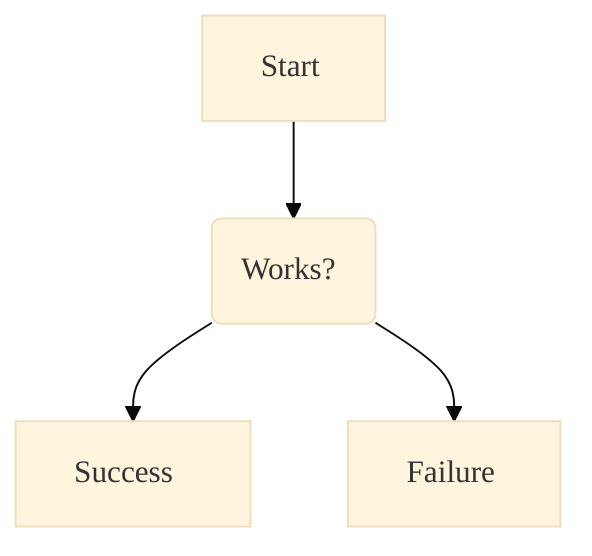

# Mermaid Diagnostic

If this renders, the issue is with the complexity or size of the other file.
If this does NOT render, the issue is with the VS Code environment/extension.

```mermaid
%%{init: {'theme': 'base', 'themeVariables': { 'fontFamily': 'sans-serif' }}}%%
graph TD
    A[Start] --> B(Works?)
    B --> C[Success]
    B --> D[Failure]
```
