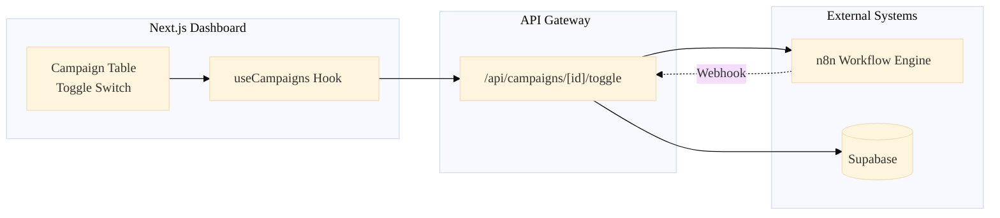
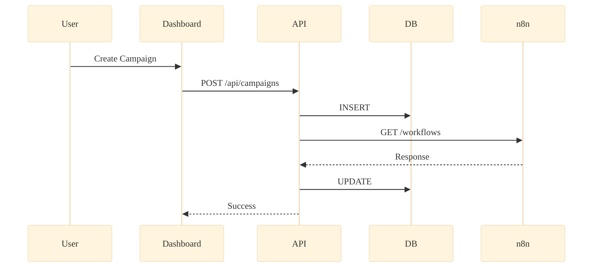
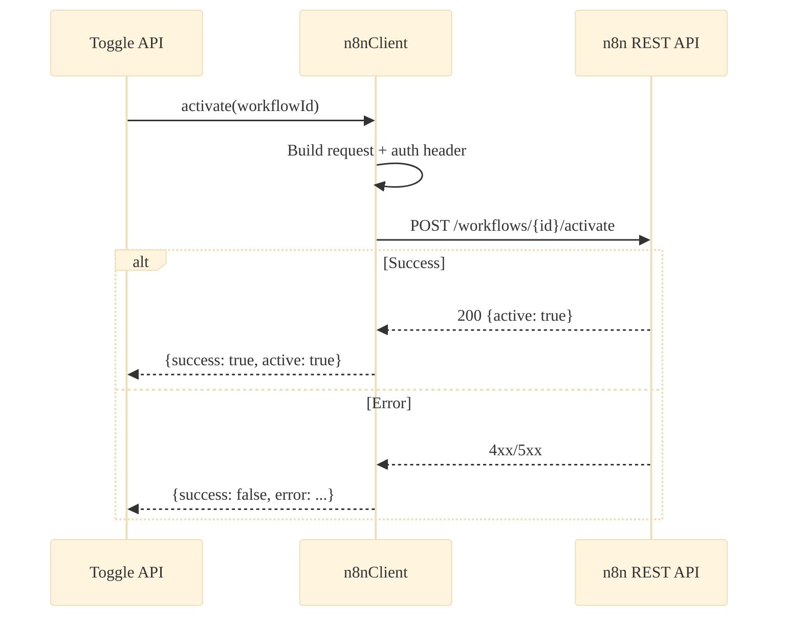
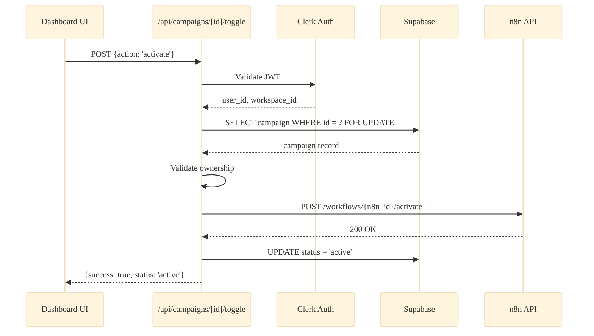
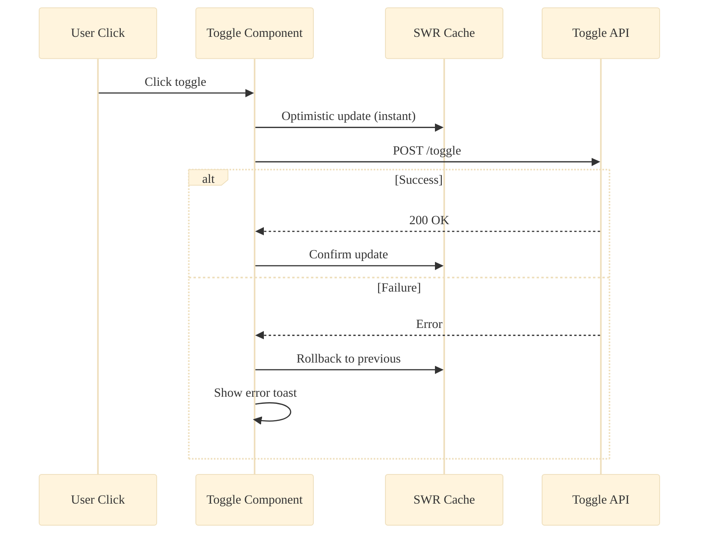
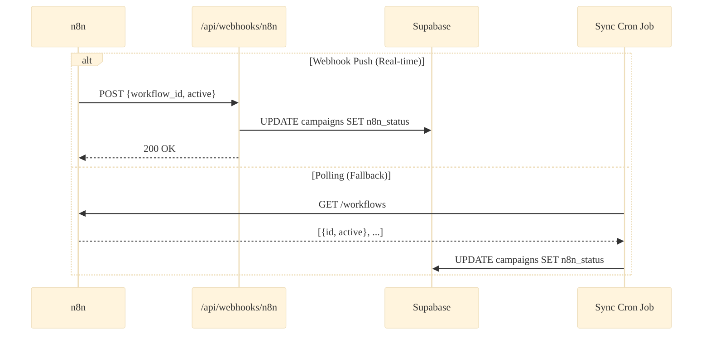

# Phase 31: God Mode — Campaign Orchestration Architecture

> **Magna Carta** for the Remote Control System connecting the Next.js Dashboard to the n8n Workflow Engine.

---

## Executive Summary

This document maps the **5 Pillars of Orchestration** across **15 Technical Dimensions** each, totaling **75 deep-dive analysis points**. We enable users to control n8n workflows (start, pause, resume) directly from the Dashboard while maintaining optimistic UI responsiveness.



---

# Pillar 1: The Schema Bridge (The State)

> **Core Systems:** `supabase/schema.sql`, `campaigns` table
> **Focus:** Storing `n8n_workflow_id` and `status` enum. Mapping 1 Campaign → 1 Workflow.

## 1.1 Architectural Data Flow



## 1.2 Concurrency Model

- **Strategy:** Pessimistic locking via `SELECT ... FOR UPDATE` when modifying campaign status
- **Conflict Resolution:** Last-write-wins for metadata, status changes require version check
- **Implementation:** Add `version` column, increment on each status change

## 1.3 Idempotency Strategy

- UUID primary key ensures no duplicate campaign creation
- Status transitions are idempotent: `active → active` is a no-op
- Add `last_status_change_at` timestamp to detect stale requests

## 1.4 Error Recovery

| Error State             | Recovery Action                                |
| ----------------------- | ---------------------------------------------- |
| n8n_workflow_id invalid | Mark `status = 'error'`, show validation error |
| DB write fails          | Return 500, UI shows retry toast               |
| Partial write           | Use transaction: all-or-nothing                |

## 1.5 Latency Budget

| Operation              | Target | Max    |
| ---------------------- | ------ | ------ |
| Status read            | 10ms   | 50ms   |
| Status update          | 50ms   | 200ms  |
| Validation (n8n check) | 200ms  | 2000ms |

## 1.6 Security Boundaries

```sql
-- RLS Policy: Users can only modify their workspace's campaigns
CREATE POLICY campaigns_workspace_isolation ON campaigns
  USING (workspace_id IN (
    SELECT workspace_id FROM user_workspaces
    WHERE user_id = auth.clerk_user_id()
  ));
```

## 1.7 Database Schema Impact

```sql
-- New columns for campaigns table
ALTER TABLE campaigns
ADD COLUMN n8n_workflow_id TEXT,
ADD COLUMN n8n_status TEXT DEFAULT 'unknown'
  CHECK (n8n_status IN ('active', 'inactive', 'unknown', 'error')),
ADD COLUMN last_sync_at TIMESTAMPTZ,
ADD COLUMN version INTEGER DEFAULT 1;

CREATE INDEX idx_campaigns_n8n_workflow ON campaigns(n8n_workflow_id);
CREATE INDEX idx_campaigns_status ON campaigns(workspace_id, status);
```

## 1.8 Data Consistency Model

- **Strategy:** Eventual Consistency with optimistic UI
- **Sync Mechanism:** Poll n8n every 60s OR webhook on status change
- **Truth Source:** n8n is authoritative for workflow runtime status

## 1.9 Scalability Constraints

| Metric                  | Current | Limit   | Notes                               |
| ----------------------- | ------- | ------- | ----------------------------------- |
| Campaigns per workspace | ~10     | 1,000   | Index supports                      |
| Total campaigns         | ~100    | 100,000 | Partition by workspace_id if needed |

## 1.10 Observability

```typescript
// Audit log entry on every status change
interface CampaignAuditLog {
  campaign_id: string;
  user_id: string;
  action: "created" | "status_changed" | "deleted";
  old_status?: CampaignStatus;
  new_status?: CampaignStatus;
  timestamp: string;
  metadata?: Record<string, unknown>;
}
```

## 1.11 Type Safety

```typescript
type CampaignStatus = "active" | "paused" | "completed" | "error" | "archived";
type N8nStatus = "active" | "inactive" | "unknown" | "error";

interface Campaign {
  id: string;
  workspace_id: string;
  name: string;
  description?: string;
  status: CampaignStatus;
  n8n_workflow_id?: string;
  n8n_status: N8nStatus;
  last_sync_at?: string;
  version: number;
  created_at: string;
  updated_at: string;
}
```

## 1.12 Maintenance Burden

- **Schema migrations:** Use Supabase migrations, always additive
- **Backward compatibility:** New columns nullable with defaults
- **Data cleanup:** Archive campaigns older than 1 year to cold storage

## 1.13 Edge Cases

| Scenario                        | Handling                                 |
| ------------------------------- | ---------------------------------------- |
| Workflow deleted in n8n         | Sync job marks `n8n_status = 'error'`    |
| Duplicate n8n_workflow_id       | UNIQUE constraint allows (user's choice) |
| Orphaned campaign (no workflow) | Allow, but warn in UI                    |

## 1.14 Cost Optimization

- Batch status queries: single SELECT for all campaigns in workspace
- Cache campaign list for 30s (SWR stale-while-revalidate)
- Don't query n8n status in list view (only on detail)

## 1.15 Future Optimization

- **Real-time sync:** Supabase Realtime subscriptions for campaign changes
- **Workflow cloning:** Generate new n8n workflow from template
- **Auto-archive:** Move completed campaigns after 30 days

---

# Pillar 2: The n8n Protocol (The Transport)

> **Core Systems:** `lib/n8n-client.ts` (New), n8n Public API
> **Focus:** HTTP calls to Activate/Deactivate workflows, Auth, Timeouts

## 2.1 Architectural Data Flow



## 2.2 Concurrency Model

- **Request queue:** Max 5 concurrent n8n API calls per instance
- **Circuit breaker:** After 3 consecutive failures, pause calls for 30s
- **Retry policy:** 3 attempts with exponential backoff (1s, 2s, 4s)

## 2.3 Idempotency Strategy

- `POST /workflows/{id}/activate` is idempotent (already active = success)
- `POST /workflows/{id}/deactivate` is idempotent (already inactive = success)
- Track request ID for deduplication in logs

## 2.4 Error Recovery

```typescript
async function withRetry<T>(fn: () => Promise<T>, maxRetries = 3): Promise<T> {
  for (let i = 0; i < maxRetries; i++) {
    try {
      return await fn();
    } catch (error) {
      if (i === maxRetries - 1) throw error;
      await sleep(1000 * Math.pow(2, i)); // Exponential backoff
    }
  }
  throw new Error("Max retries exceeded");
}
```

## 2.5 Latency Budget

| Operation           | p50   | p99   | Timeout |
| ------------------- | ----- | ----- | ------- |
| Activate workflow   | 150ms | 800ms | 5s      |
| Deactivate workflow | 100ms | 600ms | 5s      |
| Get workflow status | 80ms  | 400ms | 3s      |

## 2.6 Security Boundaries

```typescript
// Environment variables (never in client code)
const N8N_API_URL = process.env.N8N_API_URL;       // https://n8n.example.com/api/v1
const N8N_API_KEY = process.env.N8N_API_KEY;       // Bearer token

// All calls server-side only (API routes)
headers: {
  'X-N8N-API-KEY': N8N_API_KEY,
  'Content-Type': 'application/json',
}
```

## 2.7 Database Schema Impact

- No direct schema changes
- Store API call results in `campaign_audit_log` table for traceability

## 2.8 Data Consistency Model

- **Request-Response Pattern:** Synchronous status after each call
- **No long-polling:** Fire-and-forget with callback sync
- **Truth verification:** GET /workflows/{id} after mutation to confirm

## 2.9 Scalability Constraints

| Resource             | Limit       | Mitigation                 |
| -------------------- | ----------- | -------------------------- |
| n8n API rate limit   | 100 req/min | Request queue + throttling |
| Concurrent workflows | 50 active   | Queue activations          |
| Response size        | 10MB        | Pagination                 |

## 2.10 Observability

```typescript
// Log every n8n API call
logger.info("n8n_api_call", {
  method: "POST",
  endpoint: `/workflows/${workflowId}/activate`,
  duration_ms: 142,
  status_code: 200,
  workspace_id: workspace.id,
  campaign_id: campaign.id,
});
```

## 2.11 Type Safety

```typescript
// lib/n8n-client.ts
interface N8nWorkflow {
  id: string;
  name: string;
  active: boolean;
  createdAt: string;
  updatedAt: string;
}

interface N8nActivateResponse {
  id: string;
  active: boolean;
}

interface N8nError {
  message: string;
  code?: string;
  details?: unknown;
}

type N8nResult<T> =
  | { success: true; data: T }
  | { success: false; error: N8nError };
```

## 2.12 Maintenance Burden

- **API versioning:** Pin to n8n API v1, monitor deprecation notices
- **Breaking changes:** Wrap in adapter pattern for easy migration
- **Testing:** Mock n8n responses in unit tests

## 2.13 Edge Cases

| Scenario                 | Response                                       |
| ------------------------ | ---------------------------------------------- |
| Workflow not found (404) | Return error, don't update DB                  |
| n8n server unreachable   | Timeout, retry 3x, mark `sync_status: 'error'` |
| Workflow in error state  | Can still deactivate, show warning             |
| Auth token expired       | 401 → log error, alert admin                   |

## 2.14 Cost Optimization

- **Batch status checks:** Fetch all workflows in one call (`GET /workflows?active=true`)
- **Cache workflow list:** 60s TTL, invalidate on toggle
- **Skip redundant calls:** If already in desired state, no-op

## 2.15 Future Optimization

- **Webhook integration:** n8n sends status changes to our webhook
- **Connection pooling:** HTTP keep-alive for repeated calls
- **GraphQL:** If n8n supports, reduce over-fetching

---

# Pillar 3: The Command Center (The API)

> **Core Systems:** `app/api/campaigns/[id]/toggle/route.ts` > **Focus:** Secure gateway for User commands, validation, n8n calls, DB updates

## 3.1 Architectural Data Flow



## 3.2 Concurrency Model

- **Database lock:** `SELECT ... FOR UPDATE` prevents race conditions
- **Optimistic concurrency:** Check `version` column before update
- **Request deduplication:** Idempotency key in request header

## 3.3 Idempotency Strategy

```typescript
// POST /api/campaigns/[id]/toggle
// Header: X-Idempotency-Key: <uuid>

const existingRequest = await redis.get(`toggle:${idempotencyKey}`);
if (existingRequest) {
  return NextResponse.json(JSON.parse(existingRequest));
}
// ... process request ...
await redis.setex(`toggle:${idempotencyKey}`, 300, JSON.stringify(result));
```

## 3.4 Error Recovery

```typescript
try {
  // 1. Lock campaign row
  // 2. Call n8n
  // 3. Update DB
  await db.transaction(async (tx) => {
    const campaign = await tx.selectForUpdate("campaigns", id);
    const n8nResult = await n8nClient.activate(campaign.n8n_workflow_id);
    if (!n8nResult.success) throw new Error(n8nResult.error.message);
    await tx.update("campaigns", {
      status: "active",
      version: campaign.version + 1,
    });
  });
} catch (error) {
  // DB automatically rolls back
  // Return error to client for UI rollback
  return NextResponse.json(
    { success: false, error: error.message },
    { status: 500 }
  );
}
```

## 3.5 Latency Budget

| Phase           | Target    | Max        |
| --------------- | --------- | ---------- |
| Auth validation | 10ms      | 50ms       |
| DB read         | 20ms      | 100ms      |
| n8n API call    | 200ms     | 5000ms     |
| DB write        | 20ms      | 100ms      |
| **Total**       | **250ms** | **5250ms** |

## 3.6 Security Boundaries

```typescript
// API route handler
export async function POST(
  req: NextRequest,
  { params }: { params: { id: string } }
) {
  // 1. Authenticate user
  const session = await auth.protect(req);
  if (!session.userId) return unauthorized();

  // 2. Verify campaign ownership
  const campaign = await db.campaigns.findById(params.id);
  if (campaign.workspace_id !== session.workspaceId) {
    return forbidden("Cannot modify campaigns in other workspaces");
  }

  // 3. Rate limit (10 toggles/minute per user)
  const rateLimitResult = await rateLimit.check(
    `toggle:${session.userId}`,
    10,
    60
  );
  if (!rateLimitResult.success) return tooManyRequests();

  // ... proceed with toggle
}
```

## 3.7 Database Schema Impact

```sql
-- Audit log table
CREATE TABLE campaign_audit_log (
  id UUID PRIMARY KEY DEFAULT uuid_generate_v4(),
  campaign_id UUID REFERENCES campaigns(id) ON DELETE CASCADE,
  user_id TEXT NOT NULL,
  action TEXT NOT NULL CHECK (action IN ('activated', 'deactivated', 'paused', 'resumed')),
  old_status TEXT,
  new_status TEXT,
  n8n_response JSONB,
  error_message TEXT,
  created_at TIMESTAMPTZ DEFAULT NOW()
);

CREATE INDEX idx_audit_campaign ON campaign_audit_log(campaign_id, created_at DESC);
```

## 3.8 Data Consistency Model

- **Transaction boundary:** Single DB transaction wraps n8n call
- **Compensation:** If n8n succeeds but DB fails, log for manual reconciliation
- **Eventual sync:** Background job reconciles discrepancies every 5 min

## 3.9 Scalability Constraints

- **API instances:** Horizontally scalable (stateless)
- **DB connections:** Connection pooling via Supabase (max 20 per instance)
- **n8n calls:** Rate limited externally, queue if needed

## 3.10 Observability

```typescript
// Structured logging
logger.info("campaign_toggle", {
  campaign_id: params.id,
  user_id: session.userId,
  action: body.action,
  old_status: campaign.status,
  new_status: newStatus,
  n8n_latency_ms: n8nDuration,
  total_latency_ms: totalDuration,
  success: true,
});
```

## 3.11 Type Safety

```typescript
// Request/Response types
interface ToggleRequest {
  action: "activate" | "deactivate" | "pause" | "resume";
}

interface ToggleResponse {
  success: boolean;
  campaign?: {
    id: string;
    status: CampaignStatus;
    n8n_status: N8nStatus;
  };
  error?: string;
}
```

## 3.12 Maintenance Burden

- **Versioning:** API versioning via URL prefix `/api/v1/...`
- **Deprecation:** 6-month notice before breaking changes
- **Documentation:** OpenAPI spec auto-generated from types

## 3.13 Edge Cases

| Scenario                | Response Code | Message                           |
| ----------------------- | ------------- | --------------------------------- |
| Campaign not found      | 404           | "Campaign not found"              |
| No n8n_workflow_id      | 400           | "Campaign not linked to workflow" |
| Already in target state | 200           | Return current state (no-op)      |
| n8n timeout             | 504           | "Workflow engine timeout"         |

## 3.14 Cost Optimization

- **Skip n8n if status matches:** Check desired state before calling
- **Batch operations:** `POST /api/campaigns/batch-toggle` for multiple
- **Cache campaign lookup:** 5s TTL on campaign read

## 3.15 Future Optimization

- **WebSocket push:** Notify client of status changes in real-time
- **Scheduled toggles:** Queue future activate/deactivate
- **Approval workflow:** Require manager approval for production campaigns

---

# Pillar 4: The Optimistic Interface (The UI)

> **Core Systems:** `components/dashboard/campaign-table.tsx`, `hooks/use-campaigns.ts` > **Focus:** Optimistic Updates, Rollback, Loading States

## 4.1 Architectural Data Flow



## 4.2 Concurrency Model

- **Debounce:** 300ms delay before sending toggle request
- **Disable during flight:** Toggle disabled while request pending
- **Queue rapid clicks:** Only process latest state

## 4.3 Idempotency Strategy

```typescript
const [pendingState, setPendingState] = useState<boolean | null>(null);

const handleToggle = async () => {
  if (pendingState !== null) return; // Already processing

  const newState = !campaign.active;
  setPendingState(newState);

  // Optimistic update
  mutate({ ...campaign, active: newState }, false);

  try {
    await toggleCampaign(campaign.id, newState ? "activate" : "deactivate");
    mutate(); // Revalidate from server
  } catch {
    mutate(); // Rollback by revalidating
    toast.error("Failed to update campaign");
  } finally {
    setPendingState(null);
  }
};
```

## 4.4 Error Recovery

```typescript
// Rollback pattern with SWR
const rollback = useCallback(() => {
  // Revert to server state
  mutate(undefined, true); // Force revalidation
  toast.error("Failed to update campaign. Changes reverted.");
}, [mutate]);
```

## 4.5 Latency Budget

| User Perception          | Target  |
| ------------------------ | ------- |
| Toggle response (visual) | < 50ms  |
| Loading indicator appear | 100ms   |
| Toast on error           | < 500ms |
| Full round-trip visible  | < 3s    |

## 4.6 Security Boundaries

- Toggle only shown to users with `campaign:write` permission
- Disabled state for campaigns user cannot modify
- CSRF protection via SameSite cookies

## 4.7 Database Schema Impact

- No direct UI changes to schema
- UI reads from SWR cache, writes via API

## 4.8 Data Consistency Model

- **Optimistic updates:** Instant UI feedback
- **Background sync:** SWR revalidates every 30s
- **Focus revalidation:** Refresh on window focus

```typescript
const { data: campaigns, mutate } = useSWR("/api/campaigns", fetcher, {
  refreshInterval: 30000,
  revalidateOnFocus: true,
  revalidateOnReconnect: true,
});
```

## 4.9 Scalability Constraints

| Concern        | Limit    | Solution            |
| -------------- | -------- | ------------------- |
| DOM updates    | 100 rows | Virtualized table   |
| SWR cache size | 10MB     | Pagination          |
| Re-renders     | Minimize | React.memo, useMemo |

## 4.10 Observability

```typescript
// Track toggle events in analytics
useEffect(() => {
  if (toggleResult) {
    analytics.track("campaign_toggled", {
      campaign_id: campaign.id,
      new_state: toggleResult.status,
      latency_ms: toggleResult.duration,
      success: toggleResult.success,
    });
  }
}, [toggleResult]);
```

## 4.11 Type Safety

```typescript
interface UseCampaignsResult {
  campaigns: Campaign[];
  isLoading: boolean;
  error: Error | null;
  toggleCampaign: (
    id: string,
    action: "activate" | "deactivate"
  ) => Promise<ToggleResult>;
  isToggling: (id: string) => boolean;
  refresh: () => void;
}
```

## 4.12 Maintenance Burden

- **Component tests:** Playwright for toggle E2E
- **Storybook:** Visual regression for states
- **Accessibility:** ARIA attributes for toggle

## 4.13 Edge Cases

| Scenario           | UI Behavior                            |
| ------------------ | -------------------------------------- |
| Network offline    | Show offline indicator, disable toggle |
| Toggle during load | Queue, process after load              |
| 2 tabs open        | Both update via SWR focus revalidation |
| Session expired    | Redirect to login                      |

## 4.14 Cost Optimization

- **Suspend fetching:** Only fetch when tab visible
- **Pagination:** 50 campaigns per page
- **Skeleton loading:** Show immediately, reduce CLS

## 4.15 Future Optimization

- **WebSocket updates:** Real-time status without polling
- **Bulk toggle:** Select multiple, single API call
- **Undo action:** 5-second undo toast for toggle

---

# Pillar 5: The Synchronization Loop (The Truth)

> **Core Systems:** `app/api/webhooks/n8n/status-change`, cron jobs
> **Focus:** Keeping Supabase in sync if status changes in n8n directly

## 5.1 Architectural Data Flow



## 5.2 Concurrency Model

- **Webhook:** Process immediately, idempotent
- **Cron:** Run every 5 minutes, skip if previous running
- **Conflict:** Webhook timestamp wins over cron

## 5.3 Idempotency Strategy

```typescript
// Webhook handler
const handleN8nStatusChange = async (payload: N8nWebhookPayload) => {
  const { workflow_id, active, timestamp } = payload;

  // Only update if newer than last sync
  await db.campaigns
    .where("n8n_workflow_id", workflow_id)
    .where("last_sync_at", "<", timestamp)
    .update({
      n8n_status: active ? "active" : "inactive",
      last_sync_at: timestamp,
    });
};
```

## 5.4 Error Recovery

| Failure        | Recovery                        |
| -------------- | ------------------------------- |
| Webhook 500    | n8n retries 3x with backoff     |
| DB unreachable | Log to dead-letter queue, retry |
| Cron fails     | Alert, next run will reconcile  |

## 5.5 Latency Budget

| Sync Method      | Expected | Max  |
| ---------------- | -------- | ---- |
| Webhook          | < 500ms  | 5s   |
| Cron (full sync) | < 30s    | 2min |

## 5.6 Security Boundaries

```typescript
// Webhook authentication
export async function POST(req: NextRequest) {
  const signature = req.headers.get("x-n8n-signature");
  const body = await req.text();

  const expectedSig = crypto
    .createHmac("sha256", process.env.N8N_WEBHOOK_SECRET!)
    .update(body)
    .digest("hex");

  if (signature !== expectedSig) {
    return new Response("Invalid signature", { status: 401 });
  }

  // ... process webhook
}
```

## 5.7 Database Schema Impact

```sql
-- Add sync tracking columns
ALTER TABLE campaigns
ADD COLUMN sync_source TEXT CHECK (sync_source IN ('api', 'webhook', 'cron')),
ADD COLUMN sync_error TEXT;

-- Dead-letter queue for failed syncs
CREATE TABLE sync_failures (
  id UUID PRIMARY KEY DEFAULT uuid_generate_v4(),
  campaign_id UUID REFERENCES campaigns(id),
  source TEXT NOT NULL,
  payload JSONB,
  error_message TEXT,
  retry_count INTEGER DEFAULT 0,
  created_at TIMESTAMPTZ DEFAULT NOW()
);
```

## 5.8 Data Consistency Model

- **Strategy:** Trust-but-Verify
- **Webhook:** Near real-time updates (preferred)
- **Cron:** Full reconciliation every 5 min (safety net)
- **Conflict resolution:** Latest `last_sync_at` wins

## 5.9 Scalability Constraints

| Sync Type          | Limit          | Notes                   |
| ------------------ | -------------- | ----------------------- |
| Webhook throughput | 100/min        | Rate limit on n8n side  |
| Cron batch size    | 1000 campaigns | Paginate if larger      |
| Dead-letter queue  | 10,000         | Auto-purge after 7 days |

## 5.10 Observability

```typescript
// Sync metrics
metrics.gauge("campaigns_synced_total", syncedCount);
metrics.gauge("campaigns_out_of_sync", outOfSyncCount);
metrics.histogram("sync_duration_seconds", duration);

// Alert if out-of-sync > 10 for > 10 minutes
```

## 5.11 Type Safety

```typescript
interface N8nWebhookPayload {
  workflow_id: string;
  workflow_name: string;
  active: boolean;
  timestamp: string;
  event_type: "activation" | "deactivation" | "error";
}

interface SyncResult {
  campaigns_checked: number;
  campaigns_updated: number;
  campaigns_errored: number;
  duration_ms: number;
}
```

## 5.12 Maintenance Burden

- **Webhook URL:** Must be stable, update n8n if changes
- **Cron schedule:** Adjustable via env var
- **Log retention:** 30 days for sync logs

## 5.13 Edge Cases

| Scenario                | Handling                                  |
| ----------------------- | ----------------------------------------- |
| Workflow renamed in n8n | Update `n8n_workflow_name` in DB          |
| Workflow deleted in n8n | Set `n8n_status = 'deleted'`, notify user |
| Duplicate webhooks      | Idempotent, timestamp check               |
| n8n restart             | Cron will reconcile on next run           |

## 5.14 Cost Optimization

- **Skip unchanged:** Compare status before UPDATE
- **Batch API calls:** Single `GET /workflows` instead of per-workflow
- **Webhook batching:** n8n can batch status changes

## 5.15 Future Optimization

- **Supabase Realtime:** Push sync status to connected clients
- **Event sourcing:** Log all state changes for replay
- **Multi-region:** Sync across n8n instances in different regions

---

# Implementation Priority Matrix

| Phase | Pillar         | Priority | Effort | Business Value |
| ----- | -------------- | -------- | ------ | -------------- |
| 31.1  | Schema Bridge  | P0       | M      | Foundation     |
| 31.2  | n8n Protocol   | P0       | M      | Core Feature   |
| 31.3  | Command Center | P0       | L      | User-Facing    |
| 31.4  | Optimistic UI  | P1       | M      | UX Polish      |
| 31.5  | Sync Loop      | P1       | L      | Data Integrity |

---

# Files to Create/Modify

## New Files

| Path                                                   | Purpose              |
| ------------------------------------------------------ | -------------------- |
| `lib/n8n-client.ts`                                    | n8n API wrapper      |
| `app/api/campaigns/[id]/toggle/route.ts`               | Toggle endpoint      |
| `app/api/webhooks/n8n/status-change/route.ts`          | Webhook receiver     |
| `hooks/use-campaigns.ts`                               | SWR hook with toggle |
| `supabase/migrations/20251218_add_n8n_integration.sql` | Schema changes       |

## Modified Files

| Path                                      | Changes                      |
| ----------------------------------------- | ---------------------------- |
| `components/dashboard/campaign-table.tsx` | Add toggle column            |
| `lib/dashboard-types.ts`                  | Add Campaign types           |
| `.env.local`                              | Add N8N_API_URL, N8N_API_KEY |

---

> **Document Version:** 1.0
> **Author:** Systems Architect
> **Last Updated:** 2024-12-17
